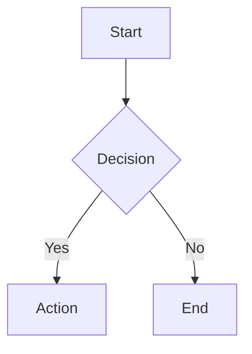

# Contributing to Fiplex Control Software

Thank you for your interest in contributing to Fiplex Control Software! This document provides guidelines and instructions for contributing to this project.

## Table of Contents

- [Code of Conduct](#code-of-conduct)
- [Getting Started](#getting-started)
- [Development Setup](#development-setup)
- [Coding Standards](#coding-standards)
- [Submitting Changes](#submitting-changes)
- [Documentation](#documentation)

## Code of Conduct

This project adheres to a professional code of conduct. By participating, you are expected to:

- Be respectful and inclusive
- Provide constructive feedback
- Focus on what is best for the project
- Show empathy towards other contributors

## Getting Started

### Prerequisites

- Windows 10/11 (x64)
- .NET 10 SDK
- Visual Studio 2022 or VS Code
- Git

### Clone the Repository

```powershell
git clone https://github.com/fiplex/control-software.git
cd control-software
```

### Build the Project

```powershell
dotnet restore
dotnet build
```

### Run Tests

```powershell
dotnet test
```

## Development Setup

### Required Tools

| Tool | Version | Purpose |
|------|---------|---------|
| .NET SDK | 10.0+ | Build framework |
| Visual Studio | 2022+ | IDE (recommended) |
| WebView2 Runtime | Latest | UI rendering |

### Optional Tools

| Tool | Purpose |
|------|---------|
| ReSharper | Code analysis |
| Mermaid CLI | Diagram validation |

### Configuration

1. Copy `appsettings.json.example` to `appsettings.json`
2. Configure development mode:

```json
{
  "DevelopmentMode": {
    "NoUSB": true,
    "SimulatedDevice": "2c1"
  }
}
```

## Coding Standards

### C# Conventions

| Element | Convention | Example |
|---------|------------|---------|
| Classes | PascalCase | `DeviceCommandRouter` |
| Interfaces | IPascalCase | `ISerialPort` |
| Methods | PascalCase | `EnqueueCommandAsync` |
| Private fields | _camelCase | `_logger` |
| Parameters | camelCase | `deviceInfo` |
| Constants | PascalCase | `MaxRetries` |

### File Organization

```csharp
// 1. Using statements
using System;
using Microsoft.Extensions.Logging;

// 2. Namespace
namespace Fiplex.Control.Software.WinForms.Core;

// 3. Class with XML documentation
/// <summary>
/// Service description.
/// </summary>
public class MyService : IMyService
{
    // 4. Constants
    private const int DefaultTimeout = 5000;
    
    // 5. Private fields
    private readonly ILogger<MyService> _logger;
    
    // 6. Constructor
    public MyService(ILogger<MyService> logger)
    {
        _logger = logger;
    }
    
    // 7. Public methods
    // 8. Private methods
}
```

### Async Guidelines

- Suffix async methods with `Async`
- Use `async/await` throughout (no `.Result` or `.Wait()`)
- Pass `CancellationToken` where appropriate

### Logging

```csharp
// Use structured logging
_logger.LogInformation("Device connected: {DeviceName} on {Port}", 
    device.Name, comPort);

// Include exception context
_logger.LogError(ex, "Failed to process command: {Command}", commandName);
```

## Submitting Changes

### Branch Naming

| Type | Pattern | Example |
|------|---------|---------|
| Feature | `feature/description` | `feature/ethernet-module` |
| Bug fix | `fix/description` | `fix/serial-timeout` |
| Documentation | `docs/description` | `docs/api-reference` |

### Commit Messages

Use conventional commits:

```
type(scope): description

[optional body]

[optional footer]
```

Types: `feat`, `fix`, `docs`, `style`, `refactor`, `test`, `chore`

Examples:
```
feat(serial): add retry logic for NAK responses
fix(auth): handle expired offline tokens
docs(readme): update installation instructions
```

### Pull Request Process

1. **Create branch** from `main`
2. **Make changes** following coding standards
3. **Test locally** - ensure build passes
4. **Update documentation** if needed
5. **Create PR** with descriptive title and body
6. **Address reviews** promptly
7. **Squash and merge** when approved

### PR Template

```markdown
## Description
Brief description of changes

## Type of Change
- [ ] Bug fix
- [ ] New feature
- [ ] Documentation update
- [ ] Refactoring

## Testing
- [ ] Tested locally
- [ ] Added/updated tests

## Documentation
- [ ] Updated relevant documentation
- [ ] Added XML comments for public APIs
```

## Documentation

### Documentation Structure

```
docs/
└── en/                    # English 
```

### Writing Documentation

- Use Markdown format
- Include Mermaid diagrams where helpful
- Keep ES and EN versions in sync
- Follow the document template in the plan

### Diagram Guidelines



- Use consistent colors and styles
- Add labels to all connections
- Keep diagrams focused and readable

---

## Questions?

If you have questions about contributing:

1. Check existing documentation in `/docs`
2. Review closed issues and PRs
3. Open a new issue with the `question` label

Thank you for contributing to Fiplex Control Software! 🎉
