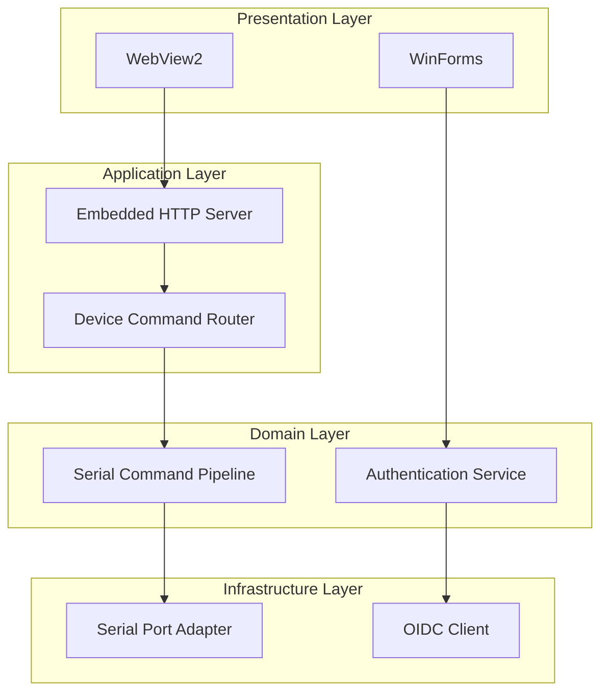

# Fiplex Control Software

**Windows control application for Fiplex devices (Signal Boosters, DAS)**

**English**

---

## 📋 Table of Contents

- [Overview](#-overview)
- [Features](#-features)
- [System Requirements](#-system-requirements)
- [Installation](#-installation)
- [Usage](#-usage)
- [Documentation](#-documentation)
- [Architecture](#-architecture)
- [Contributing](#-contributing)
- [Changelog](#-changelog)

---

## 🎯 Overview

Fiplex Control Software is a Windows desktop application built with .NET 10 and WinForms that provides comprehensive control and configuration capabilities for Fiplex telecommunications devices, including:

- **Signal Boosters** (Single and Dual Band)
- **DAS (Distributed Antenna Systems)** - Master and Remote units

The application communicates with devices via serial port (RS-232) and renders device-specific HTML interfaces using WebView2.

### Key Capabilities

| Capability | Description |
|------------|-------------|
| 🔌 Serial Communication | RS-232 protocol with command pipeline and retry logic |
| 🌐 Hybrid UI | WebView2 rendering of device-specific HTML interfaces |
| 🔐 Authentication | OIDC-based login with offline token support |
| 📜 Licensing | CLSS integration for device licensing and training validation |
| 🛠️ Configuration | Real-time device configuration and monitoring |

---

## ✨ Features

- **Multi-device Support**: Automatic device detection and configuration
- **WebView2 Integration**: Modern HTML/JS interfaces per device type
- **Embedded HTTP Server**: Bridge between WebView2 and serial commands
- **Circuit Breaker Pattern**: Resilient communication with automatic recovery
- **Offline Mode**: Works without internet after initial authentication
- **Training Validation**: CLSS integration for technician certification

---

## 💻 System Requirements

| Requirement | Specification |
|-------------|---------------|
| **OS** | Windows 10/11 (x64) |
| **Runtime** | .NET 10 Desktop Runtime |
| **WebView2** | Microsoft Edge WebView2 Runtime |
| **Port** | Available USB/Serial port |
| **Network** | Internet for initial login (optional for operation) |

---

## 📦 Installation

### Option 1: Installer (Recommended)

1. Download the latest installer from the releases page
2. Run the installer and follow the wizard
3. Launch from Start Menu or Desktop shortcut

### Option 2: Portable

1. Download the portable ZIP from releases
2. Extract to desired location
3. Run `Fiplex.Control.Software.WinForms.exe`

### Option 3: Build from Source

`powershell
# Clone repository
git clone https://github.com/fiplex/control-software.git
cd control-software

# Restore and build
dotnet restore
dotnet build -c Release

# Run
dotnet run --project src/Fiplex.Control.Software.WinForms
`

---

## 🚀 Usage

### Quick Start

1. **Connect Device**: Connect your Fiplex device via USB/Serial cable
2. **Launch Application**: Start Fiplex Control Software
3. **Login**: Enter your credentials (requires training certification)
4. **Select Port**: Choose the COM port your device is connected to
5. **Connect**: Click "Connect" to establish communication
6. **Configure**: Use the web interface to configure your device

### Connection Flow

`mermaid
flowchart LR
    A[Launch App] --> B[OIDC Login]
    B --> C[Select COM Port]
    C --> D[Click Connect]
    D --> E{Device Detected?}
    E -->|Yes| F[Load Device UI]
    E -->|No| G[Show Error]
    F --> H[Configure Device]
`

### Development Mode

For development without physical hardware:

`json
// appsettings.json
{
  "DevelopmentMode": {
    "NoUSB": true,
    "SimulatedDevice": "2c1"
  }
}
`

---

## 📚 Documentation

### Documentation Index

| Section | Language | Description |
|---------|----------|-------------|
| [Introduction](en/00-introduction/overview.md) | EN | Project overview and application map |
| [Architecture](en/10-architecture/logical-architecture.md) | EN | System architecture and design patterns |
| [Solution Structure](en/20-solution-and-projects/solution-structure.md) | EN | Project organization and dependencies |
| [Forms](en/30-forms/forms-index.md) | EN | WinForms documentation |
| [Operational Flows](en/40-operational-flows/operational-flows.md) | EN | Key workflows and sequences |
| [Error Handling](en/50-errors-and-logging/error-handling.md) | EN | Logging and error management |
| [Integrations](en/60-integrations/external-integrations.md) | EN | External system integrations |
| [Code Quality](en/70-quality-and-maintainability/code-quality.md) | EN | Quality standards and practices |

---

## 🏗️ Architecture

### High-Level Architecture

### Design Patterns

| Pattern | Usage |
|---------|-------|
| **Strategy** | Device-specific response handlers |
| **Pipeline** | Serial command processing |
| **Circuit Breaker** | Resilient device communication |
| **Adapter** | Serial port abstraction |
| **Observer** | Event-driven UI updates |

---

## 🤝 Contributing

We welcome contributions! Please see our [Contributing Guide](../CONTRIBUTING.md) for details on:

- Code of conduct
- Development setup
- Coding standards
- Pull request process

---

## 📝 Changelog

See [CHANGELOG.md](../CHANGELOG.md) for version history and release notes.

---

## 📄 License

This software is proprietary. See [LICENSE](LICENSE) for details.

---

**Fiplex Communications** | [Website](https://www.fiplex.com/) | [Support](mailto:BDAsystemsTS@honeywell.com)

