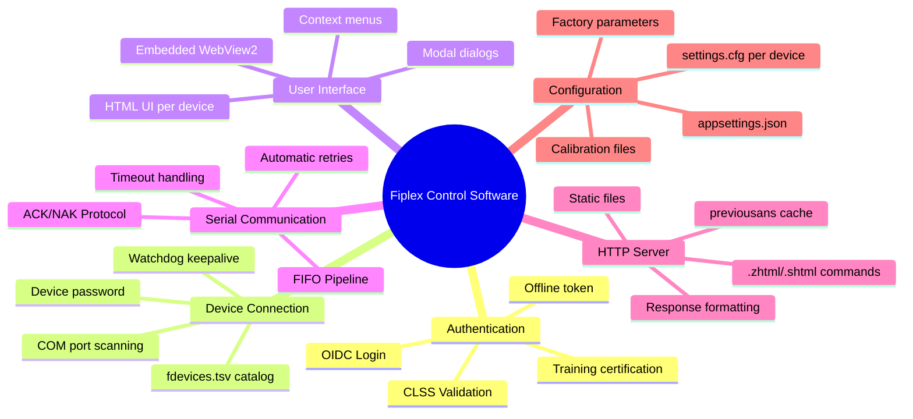
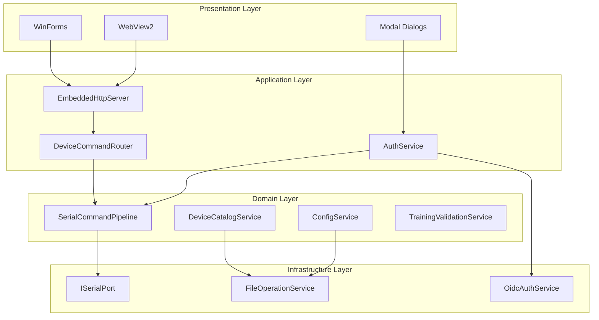
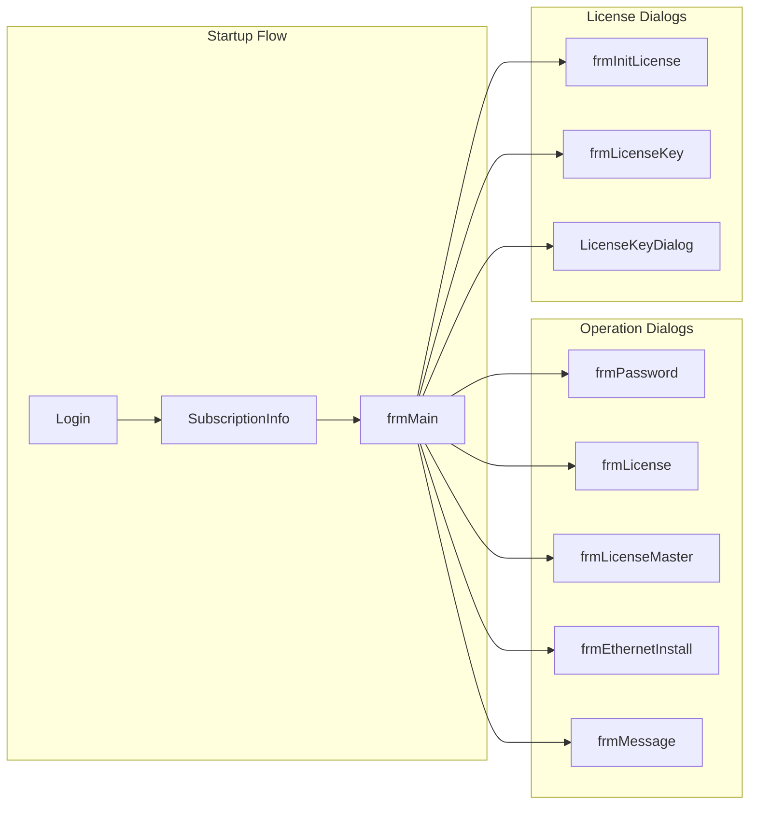
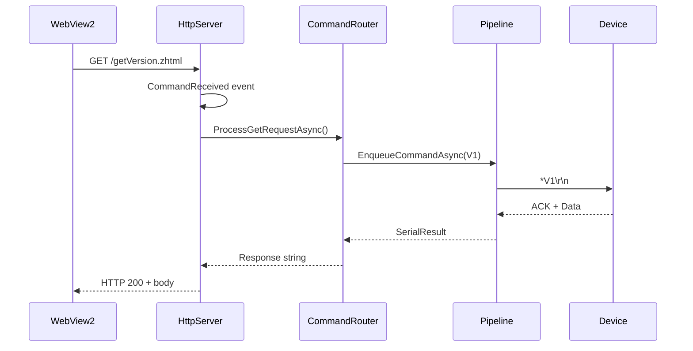

# Application Map

## Conceptual Map

## Layer Structure

## System Modules

### Security Module (`Core/Security/`)

| Class | Function |
|-------|----------|
| `AuthService` | Device authentication (command *0) |
| `OidcAuthService` | OIDC login with Firebase/Azure AD |
| `TrainingValidationService` | CLSS certification validation |
| `OfflineTokenManager` | Offline token management |
| `WatchdogService` | Device keepalive (25s) |

### Serial Module (`Core/Serial/`)

| Class | Function |
|-------|----------|
| `SerialCommandPipeline` | FIFO queue with retries |
| `SerialProtocolParser` | CR/LF frame parser |
| `SerialPortAdapter` | System.IO.Ports wrapper |
| `SimulatedSerialPort` | Mock for development |
| `ResponseValidator` | ACK/NAK validation |

### HTTP Module (`Core/Http/`)

| Class | Function |
|-------|----------|
| `EmbeddedHttpServer` | Local HTTP server 8080-8090 |
| `HttpCommandLogger` | GET command logging |
| `HttpCommandEventArgs` | Command event data |

### Commands Module (`Core/Commands/`)

| Class | Function |
|-------|----------|
| `DeviceCommandRouter` | HTTP → Serial mapping |
| `ResponseFormatter` | Hex decoding |
| `DeviceResponseProcessor` | Per-device handlers |
| `DynamicConfigBuilder` | CFG frame construction |

### Configuration Module (`Core/Config/`)

| Class | Function |
|-------|----------|
| `ConfigService` | Configuration operations |
| `SettingsParser` | settings.cfg parser |
| `CalibrationService` | .calr files |
| `FactoryParametersService` | Factory parameters |

## Main Forms

## Configuration Files

| File | Location | Purpose |
|------|----------|---------|
| `appsettings.json` | Root | General config, OIDC, endpoints |
| `fiplex.license` | Root | Encrypted CLSS license |
| `fdevices.tsv` | Resources/ | Device catalog |
| `settings.cfg` | htdocs_*/  | Command mapping per device |

## System Events

---

**Previous**: [Overview](./overview.md) | **Next**: [Logical Architecture](../10-architecture/logical-architecture.md)
