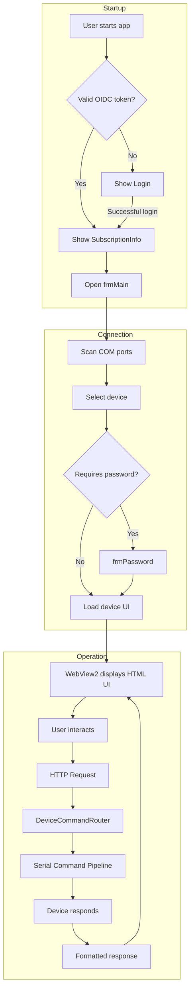

# Overview - Fiplex Control Software

## System Description

**Fiplex Control Software** is a WinForms desktop application developed in **.NET 10** that enables control, configuration, and monitoring of Fiplex devices (Signal Boosters, DAS - Distributed Antenna Systems) connected via serial port.

### Primary Purpose

The software provides an integrated graphical interface that:

1. **Discovers and connects** Fiplex devices on available COM ports
2. **Presents device UI** via WebView2 (embedded HTML/JS)
3. **Translates HTTP commands** from web UI to serial commands towards hardware
4. **Manages authentication** for both user (OIDC/Firebase) and device (password)
5. **Administers licenses** for hardware and CLSS certified training

## Main Use Cases

### 1. Field Technician
- Connect to Signal Booster devices for initial configuration
- Adjust RF parameters (power, frequencies, bands)
- Execute calibrations and save configurations

### 2. DAS Network Administrator
- Configure DAS Master and Remote devices
- Manage Ethernet Rabbit modules
- Monitor status of multiple devices

### 3. Factory Engineer
- Access factory mode (advanced parameters)
- Configure hardware licenses
- Initial equipment calibration

## High-Level Flow

## Main Components

| Component | Responsibility |
|-----------|----------------|
| `frmMain` | Main form, orchestrates connection and communication |
| `Login` | OIDC authentication with Firebase/Azure AD |
| `EmbeddedHttpServer` | Local HTTP server for WebView2 UI |
| `DeviceCommandRouter` | Translates HTTP → serial commands |
| `SerialCommandPipeline` | FIFO queue, ACK/NAK, retries |
| `DeviceCatalogService` | Device catalog (fdevices.tsv) |
| `AuthService` | Device authentication (command *0) |
| `TrainingValidationService` | CLSS license validation |

## Supported Devices

The system supports over 60 types of Fiplex devices, including:

- **Signal Boosters** (1a, 1c, 2c, 3c, 4dm)
- **DAS Masters** (1dm, 4dm, 5dm)
- **DAS Remotes** (1dr, 2dr, 3dr)
- **DAS Enterprise** (2dm, 3dm)
- **Single Carrier Amplifiers** (1c v2.2, v8.0)

Each device has its own HTML UI in `pages/htdocs_{tdev}{ndev}/`.

## Technologies Used

- **.NET 10** - Base framework
- **WinForms** - Desktop UI
- **WebView2** - HTML/JS rendering
- **System.IO.Ports** - Serial communication
- **Microsoft.Extensions.DependencyInjection** - Dependency injection
- **Duende.IdentityModel.OidcClient** - OIDC authentication

---

**Next**: [Application Map](./application-map.md)
