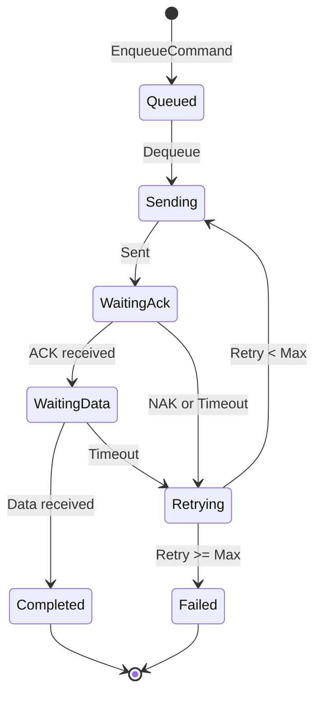

# Architectural Decisions

## ADR-001: WebView2 for Device UI

### Context
Fiplex devices have custom HTML/JS web interfaces that need to be rendered in the desktop application.

### Decision
Use **Microsoft WebView2** (Chromium-based) to render the embedded HTML/JS UIs for each device.

### Justification
- **Compatibility**: Native support for HTML5, CSS3, modern JavaScript
- **Performance**: Optimized Chromium engine
- **Maintenance**: Microsoft keeps the runtime updated
- **Integration**: Bidirectional C# ↔ JavaScript communication

### Consequences
- ✅ Device UIs work without modifications
- ✅ Automatic security updates from runtime
- ⚠️ Dependency on WebView2 Runtime (included in Windows 11)
- ⚠️ Higher memory consumption (~100MB additional)

---

## ADR-002: Embedded HTTP Server

### Context
Device HTML UIs make HTTP requests to fetch data. These requests need to be intercepted and translated to serial commands.

### Decision
Implement an **embedded HTTP server** (`EmbeddedHttpServer`) that:
1. Serves static files from `htdocs_*`
2. Intercepts requests with special extensions (`.zhtml`, `.shtml`, `.jsm`)
3. Routes commands to the serial device

### Justification
- **Transparency**: HTML UIs require no modifications
- **Simplicity**: Single integration point HTTP → Serial
- **Debugging**: Easy request/response inspection

### Alternatives Considered
| Alternative | Rejection Reason |
|-------------|------------------|
| External HTTP proxy | Additional complexity, external dependency |
| JavaScript injection | Fragility, requires modifying each UI |
| File protocol handler | Security limitations in WebView2 |

### Consequences
- ✅ Clean integration with existing UIs
- ✅ Centralized logging and debugging
- ⚠️ Local port must be available (8080-8090)

---

## ADR-003: Serial Command Pipeline

### Context
Serial communication requires management of:
- Command queue (avoid collisions)
- Timeouts and retries
- ACK/NAK protocol
- Credentials for authentication

### Decision
Implement `SerialCommandPipeline` as a **FIFO queue** with:
- Sequential command processing
- Automatic ACK/NAK handling
- Configurable retries per command
- `CredentialsRequired` event for on-demand authentication

### Justification
- **Reliability**: Guarantees execution order
- **Resilience**: Automatic retries on transient failures
- **Simplicity**: Single entry point for commands



### Consequences
- ✅ Robust device communication
- ✅ Transparent retries for the caller
- ⚠️ Additional latency from sequential processing

---

## ADR-004: Strategy Pattern for Response Handlers

### Context
Different devices/versions require special logic to process responses. For example, device 1c v2.2 has a special SCA format.

### Decision
Implement **Strategy Pattern** with `IDeviceResponseHandler`:

```csharp
public interface IDeviceResponseHandler
{
    bool CanHandle(string deviceType, double version);
    string ProcessResponse(string command, string rawResponse);
}
```

### Justification
- **Extensibility**: New handlers without modifying existing code
- **Testability**: Each handler is a testable unit
- **Separation**: Specific logic isolated

### Current Implementations
- `Device1C_V22_ResponseHandler` - SCA logic for 1c v2.2
- `Device1C_V52_ResponseHandler` - Special processing for 1c v5.2

### Consequences
- ✅ Easy to add support for new devices
- ✅ Clean and maintainable code
- ⚠️ Handler iteration overhead on each response

---

## ADR-005: Dependency Injection with Microsoft.Extensions.DI

### Context
A mechanism is required to manage dependencies, facilitate testing, and allow flexible configuration (e.g., simulated mode).

### Decision
Use **Microsoft.Extensions.DependencyInjection** for:
- Service registration in `Program.cs`
- Constructor injection in forms and services
- Support for NoUSB mode (SimulatedSerialPort)

### Justification
- **Standard**: Same system used in ASP.NET Core
- **Flexible**: Supports Singleton, Transient, Scoped
- **Testable**: Easy dependency mocking

### Configuration Example
```csharp
if (devModeSettings?.NoUSB == true)
{
    services.AddSingleton<ISerialPort, SimulatedSerialPort>();
}
else
{
    services.AddSingleton<ISerialPort, SerialPortAdapter>();
}
```

### Consequences
- ✅ Decoupled and testable code
- ✅ Centralized configuration
- ⚠️ Learning curve for developers unfamiliar with DI

---

## ADR-006: OIDC Authentication with Offline Support

### Context
Users must authenticate with Azure AD/Firebase, but the system must work offline when there's no connectivity.

### Decision
Implement OIDC flow with **offline token**:
1. Online login generates access token + refresh token
2. Offline token requested from `fire.us.honeywell.com/accessmanagement`
3. Offline token stored in `%LocalAppData%`
4. Local validation when there's no network

### Justification
- **Usability**: Field technicians don't always have connectivity
- **Security**: Signed tokens with expiration
- **Compliance**: CLSS certification requirement

### Consequences
- ✅ Operation without internet connection
- ✅ Training validation even offline
- ⚠️ Additional complexity in token management
- ⚠️ Risk of expired tokens without periodic reconnection

---

## Summary of Patterns Used

| Pattern | System Usage |
|---------|--------------|
| **Strategy** | DeviceResponseHandler for device-specific logic |
| **Pipeline** | SerialCommandPipeline for sequential processing |
| **Adapter** | SerialPortAdapter for System.IO.Ports |
| **Observer** | Events for notifications (CommandCompleted, etc.) |
| **Factory** | DI container as service factory |
| **Repository** | DeviceCatalogService for catalog access |
| **Null Object** | SimulatedSerialPort for testing |
