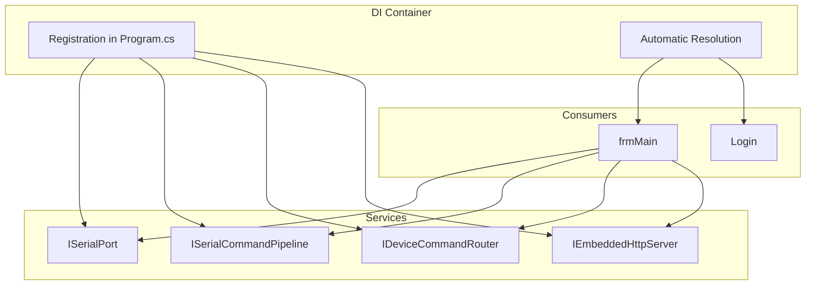
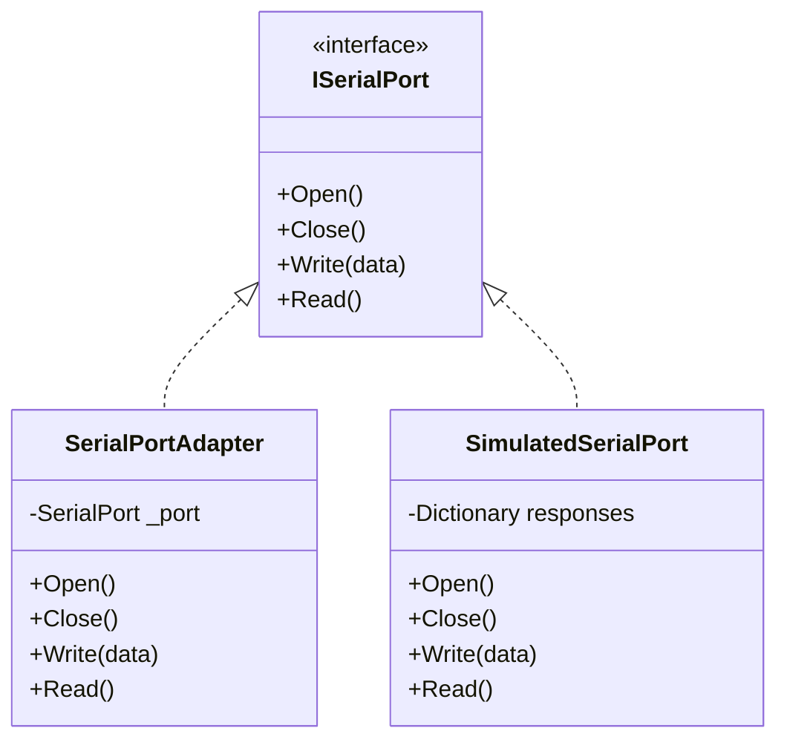
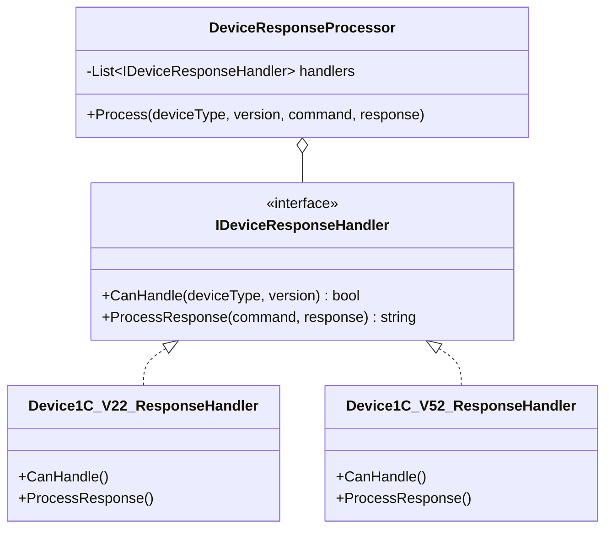
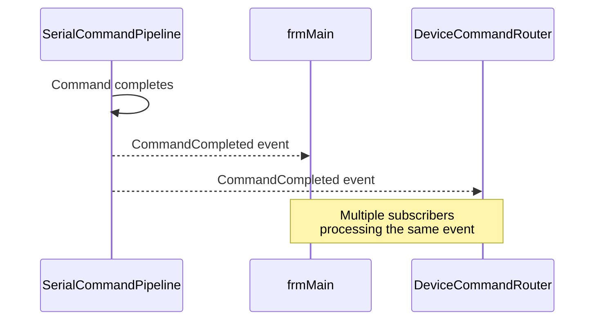
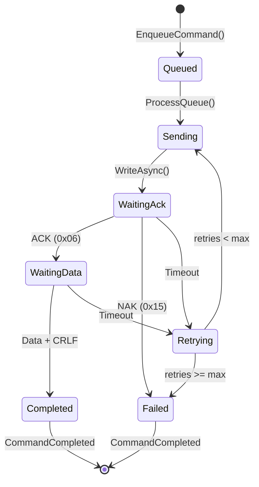
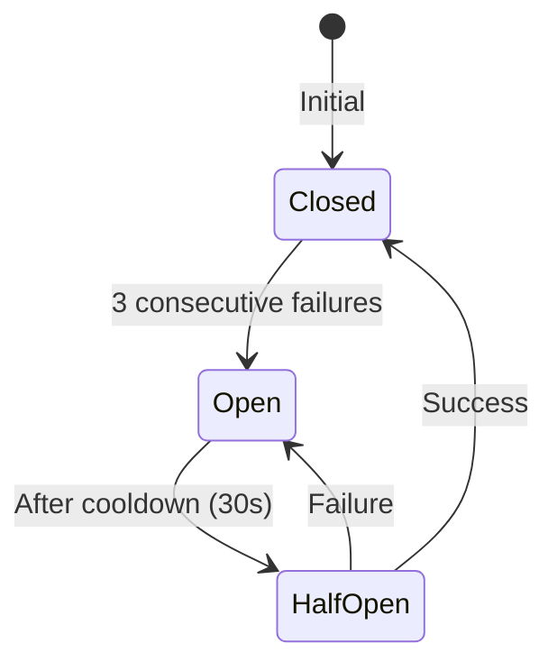

# Design Patterns

## Creational Patterns

### Dependency Injection (DI)

**Location**: `Program.cs`

The system uses Microsoft.Extensions.DependencyInjection to manage all dependencies.



**Lifecycles**:

| Type | Services |
|------|----------|
| **Singleton** | Pipeline, HttpServer, DeviceCatalog, AuthService |
| **Transient** | ConfigService, SettingsParser, CalibrationService |

---

## Structural Patterns

### Adapter Pattern

**Location**: `Core/Serial/Implementation/SerialPortAdapter.cs`

Adapts `System.IO.Ports.SerialPort` to the `ISerialPort` interface.



**Benefits**:
- Allows swapping real/simulated implementation
- Facilitates testing without hardware

---

### Strategy Pattern

**Location**: `Core/Commands/`

Implements device-specific handlers for response processing.



**Usage**:
```csharp
// The processor iterates through registered handlers
foreach (var handler in _handlers)
{
    if (handler.CanHandle(deviceType, version))
    {
        return handler.ProcessResponse(command, rawResponse);
    }
}
```

---

## Behavioral Patterns

### Observer Pattern

**Location**: Multiple services

The system uses .NET events for decoupled notifications.



**Main Events**:

| Service | Event | Purpose |
|---------|-------|---------|
| `ISerialCommandPipeline` | `CommandCompleted` | Notifies command completion |
| `ISerialCommandPipeline` | `CredentialsRequired` | Requests password |
| `ISerialCommandPipeline` | `CommandStateChanged` | State change |
| `IEmbeddedHttpServer` | `CommandReceived` | HTTP request received |
| `IEmbeddedHttpServer` | `BaseJsLoaded` | UI fully loaded |

---

### Pipeline Pattern

**Location**: `Core/Serial/Implementation/SerialCommandPipeline.cs`

Sequential command processing with defined states.



**Processing Flow**:
1. **Enqueue**: Command added to FIFO queue
2. **Dequeue**: Worker processes next command
3. **Send**: Transmission via serial port
4. **Wait ACK**: Wait for device confirmation
5. **Wait Data**: Wait for data response (if applicable)
6. **Complete/Fail**: Notify result via event

---

## Additional Patterns

### Circuit Breaker Pattern

**Location**: `Core/Commands/DeviceCommandRouter.cs`

Prevents cascading failures by temporarily stopping requests after consecutive errors.



**Configuration**:
```csharp
private const int MaxConsecutiveFailures = 3;
private const int CircuitBreakerCooldownMs = 30000;
```

---

### Null Object Pattern

**Location**: `Core/Serial/Implementation/SimulatedSerialPort.cs`

Provides a functional implementation for testing without real hardware.

```csharp
public class SimulatedSerialPort : ISerialPort
{
    private readonly Dictionary<string, string> _responses;
    
    public async Task<string> ReadAsync()
    {
        // Returns simulated response based on last command
        return _responses.GetValueOrDefault(_lastCommand, "OK");
    }
}
```

**Use Cases**:
- Unit testing without hardware
- Development without physical devices
- Demo mode for presentations

---

### Repository Pattern

**Location**: `Core/Devices/DeviceCatalogService.cs`

Abstracts access to the device catalog (`fdevices.tsv`).

```csharp
public interface IDeviceCatalogService
{
    DeviceInfo? GetById(string id);
    DeviceInfo? GetByTDevNDev(string tdev, string ndev);
    IEnumerable<DeviceInfo> GetAll();
}
```

---

## Pattern Summary by Layer

| Layer | Patterns |
|-------|----------|
| **Presentation** | Observer (events), Dependency Injection |
| **Application** | Pipeline, Strategy, Circuit Breaker |
| **Domain** | Repository, Null Object |
| **Infrastructure** | Adapter, Factory |

---

**Previous**: [Physical Architecture](./physical-architecture.md) | **Next**: [Solution Structure](../20-solution-and-projects/solution-structure.md)
