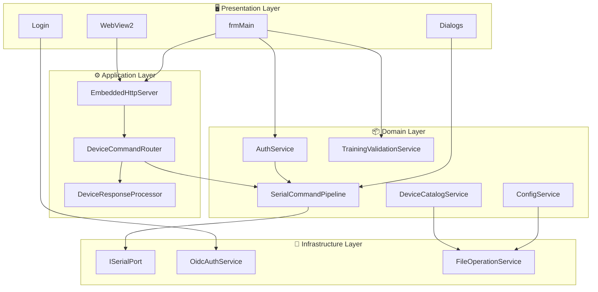
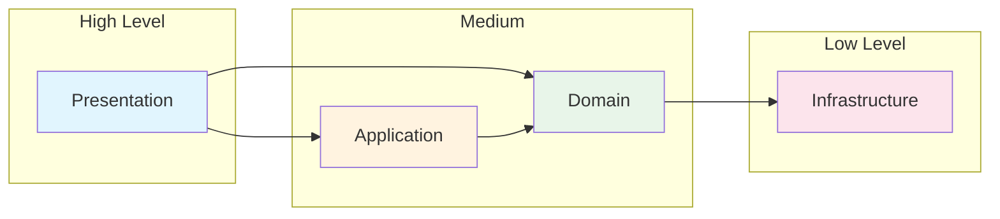

# Logical Architecture

## Layer Overview

The Fiplex Control Software system follows a **4-layer architecture** with clear separation of responsibilities and extensive use of **Dependency Injection**.



## Layer Descriptions

### 1. Presentation Layer

**Responsibility**: User interaction and visual rendering.

| Component | Description |
|-----------|-------------|
| `frmMain` | Main form, orchestrates the entire application |
| `Login` | User OIDC authentication |
| `SubscriptionInfo` | Displays license/training information |
| `frmPassword` | Captures device password |
| `frmLicense` | Hardware license configuration |
| `WebView2` | Renders device HTML UI |

**Patterns used**:
- **Implicit MVP**: Forms as presenters with logic delegated to services
- **Modal dialogs**: For operations requiring user input

### 2. Application Layer

**Responsibility**: Business flow coordination and translation between layers.

| Component | Description |
|-----------|-------------|
| `EmbeddedHttpServer` | Local HTTP server serving UI and capturing commands |
| `DeviceCommandRouter` | Translates HTTP requests to serial commands |
| `DeviceResponseProcessor` | Applies device-specific handlers |
| `ResponseFormatter` | Formats responses (hex decoding) |

**Patterns used**:
- **Strategy Pattern**: `IDeviceResponseHandler` for device-specific logic
- **Mediator**: `DeviceCommandRouter` coordinates between HTTP and Serial

### 3. Domain Layer

**Responsibility**: Core business logic and system rules.

| Component | Description |
|-----------|-------------|
| `SerialCommandPipeline` | FIFO queue with ACK/NAK, retries and timeouts |
| `DeviceCatalogService` | Catalog of supported devices |
| `AuthService` | Device authentication (command *0) |
| `TrainingValidationService` | CLSS certification validation |
| `ConfigService` | Device configuration operations |
| `CalibrationService` | Calibration file management |

**Patterns used**:
- **Repository Pattern**: `DeviceCatalogService` abstracts data access
- **Pipeline Pattern**: `SerialCommandPipeline` for sequential processing
- **Observer Pattern**: Events for state notifications

### 4. Infrastructure Layer

**Responsibility**: External resource access and persistence.

| Component | Description |
|-----------|-------------|
| `ISerialPort` | Serial port abstraction |
| `SerialPortAdapter` | Real implementation with System.IO.Ports |
| `SimulatedSerialPort` | Mock for development without hardware |
| `OidcAuthService` | OIDC client for Azure AD/Firebase |
| `FileOperationService` | File operations (.cfgr, .calr) |

**Patterns used**:
- **Adapter Pattern**: `SerialPortAdapter` adapts System.IO.Ports
- **Null Object Pattern**: `SimulatedSerialPort` for testing

## Dependency Flow



## Applied Design Principles

### SOLID

| Principle | Application |
|-----------|-------------|
| **S**ingle Responsibility | Each service has a single responsibility |
| **O**pen/Closed | Extensible via `IDeviceResponseHandler` |
| **L**iskov Substitution | `SimulatedSerialPort` substitutes `SerialPortAdapter` |
| **I**nterface Segregation | Specific interfaces: `ISerialPort`, `IEmbeddedHttpServer` |
| **D**ependency Inversion | Everything depends on abstractions (interfaces) |

### Other Principles

- **DRY**: Common logic extracted to reusable services
- **KISS**: Preference for simple and direct solutions
- **Separation of Concerns**: Well-defined layers

## Dependency Injection

Configured in `Program.cs`:

```csharp
// DI configuration example
services.AddSingleton<ISerialPort, SerialPortAdapter>();
services.AddSingleton<ISerialCommandPipeline, SerialCommandPipeline>();
services.AddSingleton<IDeviceCommandRouter, DeviceCommandRouter>();
services.AddSingleton<IEmbeddedHttpServer, EmbeddedHttpServer>();
services.AddTransient<IConfigService, ConfigService>();
```

### Lifecycles

| Type | Use |
|------|-----|
| **Singleton** | Services with shared state (Pipeline, HttpServer) |
| **Transient** | Independent operations (ConfigService, SettingsParser) |

---

**Previous**: [Application Map](../00-introduction/application-map.md) | **Next**: [Physical Architecture](./physical-architecture.md)
