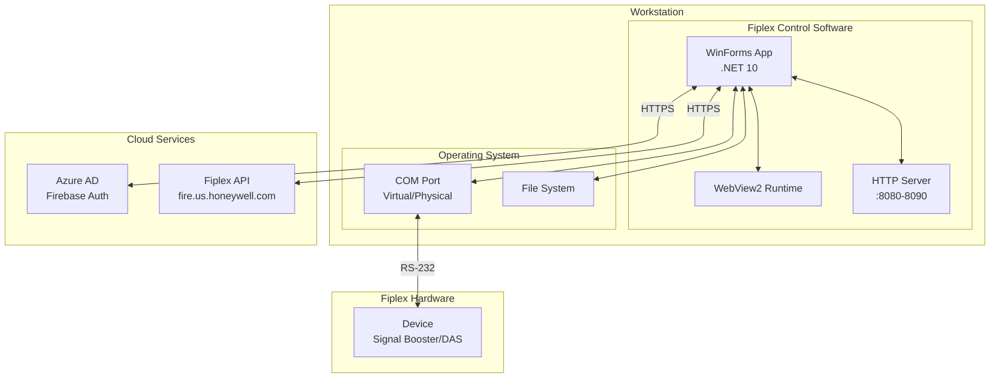
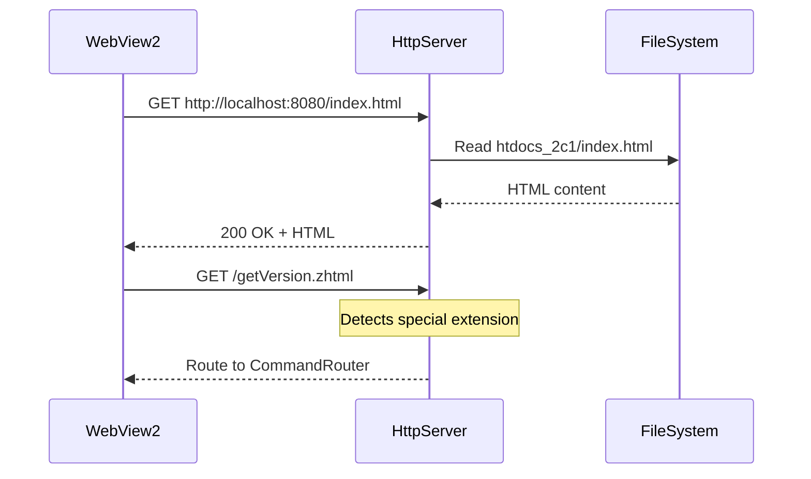
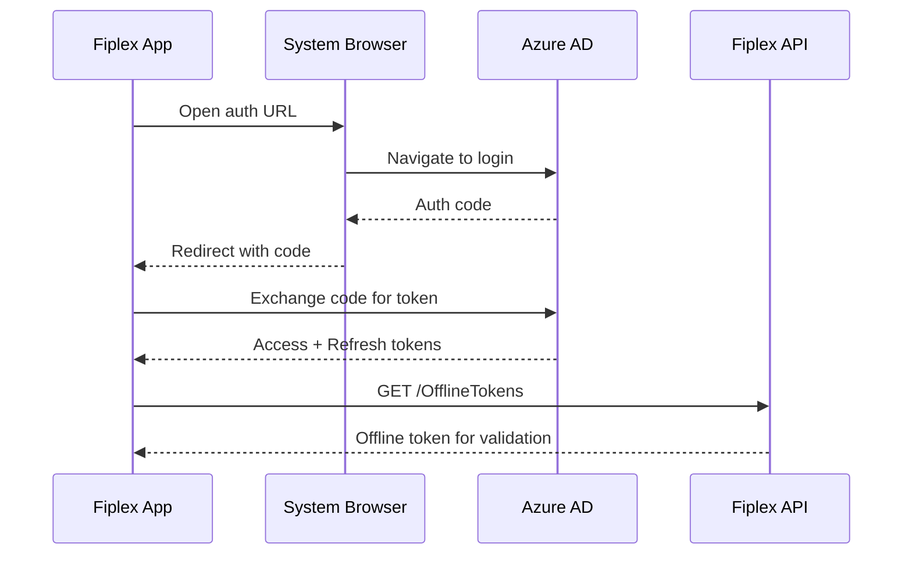

# Physical Architecture

## Deployment Diagram



## System Requirements

### Minimum Hardware

| Component | Requirement |
|-----------|-------------|
| **Processor** | x64, 1.6 GHz dual-core |
| **RAM** | 4 GB (8 GB recommended) |
| **Storage** | 500 MB free space |
| **Serial Port** | USB-to-Serial adapter or physical COM |

### Required Software

| Component | Version |
|-----------|---------|
| **Operating System** | Windows 10 1903+ / Windows 11 |
| **.NET Runtime** | 10.0 (included in distribution) |
| **WebView2 Runtime** | Evergreen (auto-updateable) |
| **USB-Serial Driver** | Per adapter used |

## Disk File Structure

```
📁 C:\Program Files\Fiplex Control Software\
├── 📄 Fiplex.Control.Software.WinForms.exe
├── 📄 Fiplex.Control.Software.WinForms.dll
├── 📄 appsettings.json
├── 📄 fiplex.license
├── 📁 Assets/
│   ├── 📁 Icons/
│   ├── 📁 Images/
│   └── 📁 Logos/
├── 📁 pages/
│   ├── 📁 htdocs_default/
│   ├── 📁 htdocs_1c1/
│   ├── 📁 htdocs_2c1/
│   ├── 📁 htdocs_5dm1/
│   └── ...
└── 📁 runtimes/
    └── win-x64/
```

## User Data Files

```
📁 %LocalAppData%\Fiplex.Control.Software\
├── 📄 offline_token.json      # Offline OIDC token
├── 📄 appsettings.user.json   # User configuration
├── 📁 HttpCommandLogs/        # HTTP debug logs
│   └── 📄 2025-12-08_commands.log
└── 📁 Calibrations/           # Calibration files
    └── 📄 device_001.calr
```

## Serial Communication

### RS-232 Protocol

| Parameter | Value |
|-----------|-------|
| **Baud Rate** | 9600 bps |
| **Data Bits** | 8 |
| **Parity** | None |
| **Stop Bits** | 1 |
| **Flow Control** | None |

### Frame Format

```
TX Command:  *{CMD}{PARAMS}\r\n
Response:    ACK (0x06) + DATA\r\n  or  NAK (0x15)
```

## HTTP Communication

### Embedded Server



### Special Extensions

| Extension | Behavior |
|-----------|----------|
| `.zhtml` | GET command, text response |
| `.shtml` | GET command, HTML response |
| `.jsm` | GET command, JavaScript response |

## Cloud Services

### Azure AD / Firebase



### Main Endpoints

| Endpoint | Purpose |
|----------|---------|
| `login.microsoftonline.com` | OIDC authentication |
| `fire.us.honeywell.com/accessmanagement` | Offline tokens |
| `fire.us.honeywell.com/glsscms` | CM services |
| `www.fiplex.com/poms` | Version checking |

## Network Considerations

### Firewall

Required ports:

| Port | Direction | Use |
|------|-----------|-----|
| 443 | Outbound | HTTPS to cloud services |
| 8080-8090 | Local | Embedded HTTP server |

### Offline Mode

The system supports offline operation through:

1. **Offline token** stored locally
2. **Local validation** of CLSS certification
3. **No dependency** on cloud services for basic operation

---

**Previous**: [Logical Architecture](./logical-architecture.md) | **Next**: [Architectural Decisions](./architectural-decisions.md)
