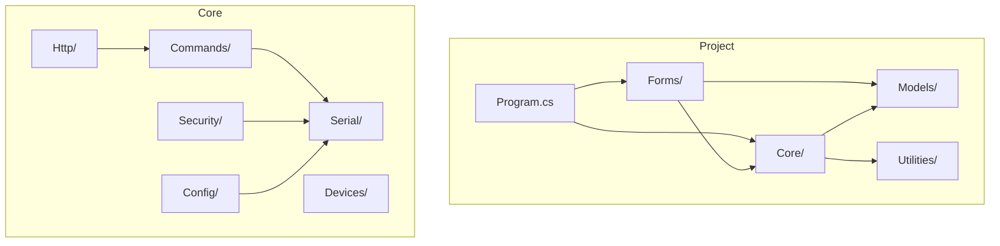

# Solution Structure

## General Description

The **Fiplex.Control.Software.WinForms** project is a Windows Forms desktop application developed in .NET 10 that contains all presentation, application, and domain logic for controlling Fiplex devices.

## Folder Structure

```
📁 Fiplex.Control.Software.WinForms/
├── 📄 Program.cs                    # Entry point, DI configuration
├── 📄 appsettings.json              # Application configuration
├── 📄 fiplex.license                # Encrypted CLSS license
├── 📄 *.csproj                      # Project configuration
│
├── 📁 Application/                  # Application layer
│   ├── 📁 Services/                 # Application services
│   └── 📁 UseCases/                 # Use cases
│
├── 📁 Assets/                       # Visual resources
│   ├── 📁 Icons/                    # Application icons
│   ├── 📁 Images/                   # Images
│   ├── 📁 Logos/                    # Logos
│   └── 📁 Temp/                     # Temporary files
│
├── 📁 Core/                         # Domain logic
│   ├── 📁 Commands/                 # HTTP→Serial routing
│   ├── 📁 Config/                   # Configuration services
│   ├── 📁 Configuration/            # Theme and settings
│   ├── 📁 Devices/                  # Catalog and discovery
│   ├── 📁 Http/                     # Embedded HTTP server
│   ├── 📁 Metrics/                  # Command metrics
│   ├── 📁 Security/                 # Authentication and validation
│   └── 📁 Serial/                   # Serial communication
│
├── 📁 Forms/                        # WinForms forms
│   ├── 📄 frmMain.cs                # Main form
│   ├── 📄 Login.cs                  # OIDC authentication
│   ├── 📄 frmPassword.cs            # Device password
│   └── ...
│
├── 📁 Models/                       # Data models
│   ├── 📄 DeviceInfo.cs             # Device information
│   ├── 📄 DeviceConfiguration.cs    # Command configuration
│   ├── 📄 SessionContext.cs         # Session context
│   └── ...
│
├── 📁 Properties/                   # Project properties
│   └── 📄 Resources.resx            # Embedded resources
│
├── 📁 Resources/                    # Resource files
│   └── 📄 fdevices.tsv              # Device catalog
│
├── 📁 Utilities/                    # Utilities
│   └── 📁 Extensions/               # Extension methods
│
└── 📁 pages/                        # HTML UI per device
    ├── 📁 htdocs_default/           # Default UI
    ├── 📁 htdocs_1c1/               # Signal Booster 1c v1.0
    ├── 📁 htdocs_2c1/               # Signal Booster 2c v1.0
    ├── 📁 htdocs_5dm1/              # DAS Master 5dm v1.0
    └── ...
```

## Folder Details

### Core/Commands/

Module for routing and processing HTTP → Serial commands.

| File | Responsibility |
|------|----------------|
| `DeviceCommandRouter.cs` | HTTP→Serial mapping, cache, circuit breaker |
| `ResponseFormatter.cs` | Hex decoding, response formatting |
| `DeviceResponseProcessor.cs` | Handler orchestrator |
| `Device1C_V22_ResponseHandler.cs` | SCA logic for 1c v2.2 |
| `Device1C_V52_ResponseHandler.cs` | Handler for 1c v5.2 |
| `DynamicConfigBuilder.cs` | CFG frame construction |
| `LicenseOptionsParser.cs` | Hex parser for M0/M1 |

### Core/Serial/

Serial communication with devices.

```
📁 Serial/
├── 📁 Interfaces/
│   ├── ISerialPort.cs
│   ├── ISerialCommandPipeline.cs
│   ├── ISerialProtocolParser.cs
│   └── IResponseValidator.cs
├── 📁 Implementation/
│   ├── SerialPortAdapter.cs
│   ├── SimulatedSerialPort.cs
│   ├── SerialCommandPipeline.cs
│   ├── SerialProtocolParser.cs
│   └── ResponseValidator.cs
└── 📁 Models/
    ├── SerialCommand.cs
    ├── SerialResult.cs
    ├── SerialFrame.cs
    ├── CommandState.cs
    └── ...
```

### Core/Security/

Authentication and security.

| File | Responsibility |
|------|----------------|
| `AuthService.cs` | Device authentication (*0 command) |
| `OidcAuthService.cs` | OIDC login Azure AD/Firebase |
| `TrainingValidationService.cs` | CLSS certification validation |
| `OfflineTokenManager.cs` | Offline token management |
| `OfflineTokenValidator.cs` | Local token validation |
| `WatchdogService.cs` | Device keepalive |
| `LicenseValidator.cs` | License validation |
| `WinFormsWebView2Browser.cs` | Browser for OIDC flow |

### Core/Config/

Configuration and calibration services.

| File | Responsibility |
|------|----------------|
| `ConfigService.cs` | Configuration operations |
| `SettingsParser.cs` | settings.cfg parser |
| `CalibrationService.cs` | .calr files |
| `FactoryParametersService.cs` | Factory parameters |
| `FileOperationService.cs` | File operations |
| `EthernetModuleService.cs` | Ethernet Rabbit module |

### Forms/

Application WinForms forms.

| Form | Function |
|------|----------|
| `frmMain` | Main window, WebView2, menus |
| `Login` | User OIDC authentication |
| `SubscriptionInfo` | Subscription/training information |
| `frmPassword` | Device password capture |
| `frmLicense` | Hardware licenses (2 bands) |
| `frmLicenseMaster` | Hardware licenses (4 bands) |
| `frmEthernetInstall` | Ethernet module configuration |
| `frmInitLicense` | License initialization |
| `frmLicenseKey` | License key entry |
| `LicenseKeyDialog` | Key dialog |
| `frmMessage` | Progress dialog |

### Models/

Data models (immutable Records preferred).

| Model | Description |
|-------|-------------|
| `DeviceInfo` | Device information from catalog |
| `DeviceConfiguration` | GET/POST/FILE commands from settings.cfg |
| `SessionContext` | Active session context |
| `ConnectionState` | Connection states (enum) |
| `SerialCommand` | Serial command to execute |
| `SerialResult` | Serial command result |
| `OidcSettings` | OIDC configuration |
| `LicenseOptions` | Hardware license options |

## Dependency Diagram



---

**Previous**: [Design Patterns](../10-architecture/design-patterns.md) | **Next**: [Technical Dependencies](./technical-dependencies.md)
