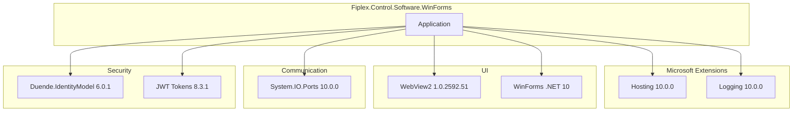

# Technical Dependencies

## NuGet Packages

The project uses the following NuGet packages:

### Microsoft Extensions

| Package | Version | Purpose |
|---------|---------|---------|
| `Microsoft.Extensions.Hosting` | 10.0.0 | Generic host, configuration, DI |
| `Microsoft.Extensions.Logging.Abstractions` | 10.0.0 | Logging abstractions |
| `Microsoft.Extensions.Logging.Console` | 10.0.0 | Console logging provider |
| `Microsoft.Extensions.Logging.Debug` | 10.0.0 | Debug logging provider |

### WebView2

| Package | Version | Purpose |
|---------|---------|---------|
| `Microsoft.Web.WebView2` | 1.0.2592.51 | WebView2 control for HTML rendering |

### Serial Communication

| Package | Version | Purpose |
|---------|---------|---------|
| `System.IO.Ports` | 10.0.0 | Serial port access |

### Authentication

| Package | Version | Purpose |
|---------|---------|---------|
| `Duende.IdentityModel.OidcClient` | 6.0.1 | OIDC client for authentication |
| `System.IdentityModel.Tokens.Jwt` | 8.3.1 | JWT token handling |

## Dependency Diagram



## Framework Requirements

### .NET 10

The project is configured for .NET 10 with Windows Forms:

```xml
<Project Sdk="Microsoft.NET.Sdk">
  <PropertyGroup>
    <OutputType>WinExe</OutputType>
    <TargetFramework>net10.0-windows</TargetFramework>
    <Nullable>enable</Nullable>
    <UseWindowsForms>true</UseWindowsForms>
    <ImplicitUsings>enable</ImplicitUsings>
  </PropertyGroup>
</Project>
```

### Enabled Features

| Feature | Description |
|---------|-------------|
| **Nullable** | Nullable references enabled |
| **ImplicitUsings** | Implicit global usings |
| **UseWindowsForms** | Windows Forms SDK |

## Version Information

```xml
<PropertyGroup>
  <Version>3.0.0</Version>
  <AssemblyVersion>3.0.0.0</AssemblyVersion>
  <FileVersion>3.0.0.0</FileVersion>
  
  <Product>Fiplex Control Software</Product>
  <Company>Fiplex Communications</Company>
  <Copyright>Copyright © Fiplex Communications 2026</Copyright>
</PropertyGroup>
```

## Embedded Resources

### fdevices.tsv

Supported device catalog, embedded as resource:

```xml
<ItemGroup>
  <EmbeddedResource Include="Resources\fdevices.tsv" />
</ItemGroup>
```

### Configuration Files

```xml
<ItemGroup>
  <None Update="appsettings.json">
    <CopyToOutputDirectory>PreserveNewest</CopyToOutputDirectory>
  </None>
  <None Update="fiplex.license">
    <CopyToOutputDirectory>PreserveNewest</CopyToOutputDirectory>
  </None>
</ItemGroup>
```

## WebView2 Runtime

### Requirements

The WebView2 control requires the **WebView2 Runtime** installed on the system:

- **Windows 11**: Included by default
- **Windows 10**: May require manual installation

### Distribution

Runtime distribution options:

| Option | Description |
|--------|-------------|
| **Evergreen** | Auto-updatable, recommended |
| **Fixed Version** | Specific version packaged |

## Compatibility

### Operating Systems

| OS | Minimum Version | Support |
|----|-----------------|---------|
| Windows 11 | All | ✅ Full |
| Windows 10 | 1903 (19H1) | ✅ Full |
| Windows 10 | < 1903 | ⚠️ Limited |
| Windows 7/8 | - | ❌ Not supported |

### Architectures

| Architecture | Support |
|--------------|---------|
| x64 | ✅ Primary |
| x86 | ⚠️ Limited |
| ARM64 | ❌ Not tested |

## Build Commands

### Debug

```powershell
dotnet build
dotnet run
```

### Release

```powershell
dotnet build -c Release
```

### Publishing

```powershell
# Self-contained portable
dotnet publish -c Release -r win-x64 --self-contained

# Framework-dependent
dotnet publish -c Release -r win-x64 --self-contained false
```

## Package Updates

To update dependencies:

```powershell
# List outdated packages
dotnet list package --outdated

# Update specific package
dotnet add package <PackageName>

# Update all packages (use with caution)
dotnet outdated --upgrade
```

---

**Previous**: [Solution Structure](./solution-structure.md) | **Next**: [Forms Index](../30-forms/forms-index.md)
