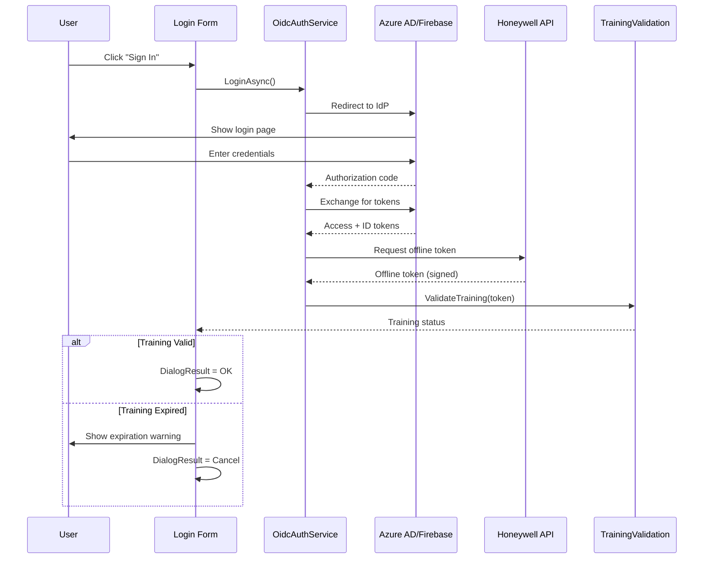

# Login - OIDC Authentication

## General Information

| Attribute | Value |
|-----------|-------|
| **File** | `Forms/Login.cs` |
| **Namespace** | `Fiplex.Control.Software.WinForms.Forms` |
| **Type** | Modal Form |
| **Lines of Code** | ~353 |

## Purpose

User authentication form via OIDC (OpenID Connect) with support for:
- Azure AD / Firebase login
- Offline token for operation without connectivity
- CLSS training expiration validation

## Injected Dependencies

| Service | Interface | Purpose |
|---------|-----------|---------|
| `_oidcService` | `IOidcAuthService` | OIDC authentication |
| `_trainingValidation` | `ITrainingValidationService` | Training validation |
| `_offlineTokenManager` | `IOfflineTokenManager` | Offline token storage |
| `_logger` | `ILogger<Login>` | Logging |

## Authentication Flow



## Public Properties

| Property | Type | Description |
|----------|------|-------------|
| `AuthResult` | `AuthResult?` | Authentication result |
| `IsAuthenticated` | `bool` | Whether authentication succeeded |
| `UserEmail` | `string?` | Authenticated user email |

## Main Methods

### PerformLoginAsync

```csharp
private async Task PerformLoginAsync()
{
    try
    {
        btnSignIn.Enabled = false;
        lblStatus.Text = "Signing in...";
        
        var result = await _oidcService.LoginAsync();
        
        if (result.IsSuccess)
        {
            // Validate training before accepting
            var trainingValid = await _trainingValidation
                .ValidateTrainingAsync(result.AccessToken);
            
            if (!trainingValid)
            {
                ShowTrainingExpiredWarning();
                return;
            }
            
            AuthResult = result;
            DialogResult = DialogResult.OK;
        }
        else
        {
            ShowError(result.ErrorMessage);
        }
    }
    finally
    {
        btnSignIn.Enabled = true;
    }
}
```

### ValidateOfflineToken

```csharp
private async Task<bool> TryOfflineLoginAsync()
{
    var offlineToken = await _offlineTokenManager.GetStoredTokenAsync();
    
    if (offlineToken == null)
        return false;
    
    var isValid = _offlineTokenManager.ValidateToken(offlineToken);
    
    if (isValid)
    {
        AuthResult = new AuthResult
        {
            IsSuccess = true,
            AccessToken = offlineToken,
            IsOfflineToken = true
        };
        return true;
    }
    
    return false;
}
```

## UI Controls

| Control | Type | Purpose |
|---------|------|---------|
| `btnSignIn` | Button | Initiate OIDC login |
| `lblStatus` | Label | Status messages |
| `lblEmail` | Label | Show authenticated email |
| `pbLogo` | PictureBox | Fiplex logo |
| `chkRemember` | CheckBox | Remember login (future) |

## Visual Layout

```
┌──────────────────────────────────────┐
│         [Fiplex Logo]                │
├──────────────────────────────────────┤
│                                      │
│   Welcome to Fiplex Control          │
│                                      │
│   Please sign in to continue         │
│                                      │
│         [Sign In with SSO]           │
│                                      │
│   Status: Ready                      │
│                                      │
└──────────────────────────────────────┘
```

## OIDC Settings

Configuration in `appsettings.json`:

```json
{
  "OidcSettings": {
    "Authority": "https://login.microsoftonline.com/{tenant}",
    "ClientId": "your-client-id",
    "RedirectUri": "http://localhost:5000/callback",
    "Scope": "openid profile email offline_access",
    "PostLogoutRedirectUri": "http://localhost:5000/"
  }
}
```

## Offline Token Storage

```csharp
// Token stored in %LocalAppData%\Fiplex\tokens\
private readonly string _tokenPath = Path.Combine(
    Environment.GetFolderPath(Environment.SpecialFolder.LocalApplicationData),
    "Fiplex", "tokens", "offline.token");
```

## Error Handling

| Error | Action |
|-------|--------|
| Network failure | Attempt offline login |
| Invalid credentials | Show error, allow retry |
| Training expired | Show warning, block access |
| Token expired | Force re-authentication |

## Integration with frmMain

```csharp
// In frmMain or startup
var login = _serviceProvider.GetRequiredService<Login>();

if (login.ShowDialog() == DialogResult.OK)
{
    _sessionContext.User = login.UserEmail;
    _sessionContext.AccessToken = login.AuthResult.AccessToken;
    
    // Continue to main application
    Show();
}
else
{
    Application.Exit();
}
```

---

**Previous**: [frmMain](./frmMain.md) | **Next**: [frmPassword](./frmPassword.md)
