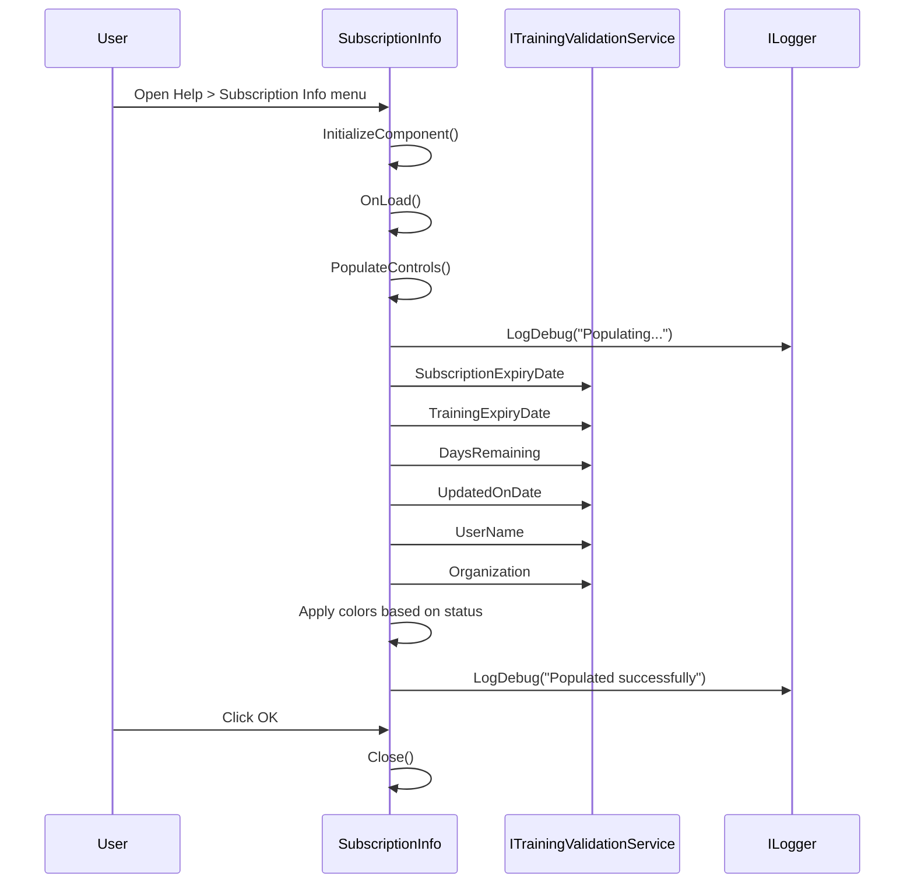

# SubscriptionInfo - Subscription Information

## General Information

| Attribute | Value |
|-----------|-------|
| **File** | `Forms/SubscriptionInfo.cs` |
| **Namespace** | `Fiplex.Control.Software.WinForms.Forms` |
| **Type** | Modal Dialog |
| **Inherits from** | `System.Windows.Forms.Form` |

## Purpose

Informational dialog that displays the user's subscription status and CLSS (Certified Life Safety Systems) training. Allows viewing:

- Subscription expiration date
- CLSS training expiration date
- Last update date
- User and organization information

## Injected Dependencies

| Service | Interface | Purpose |
|---------|-----------|---------|
| `_trainingValidation` | `ITrainingValidationService` | Gets subscription and training data |
| `_logger` | `ILogger<SubscriptionInfo>` | Structured logging |

## Displayed Fields

### Subscription Information

| Field | Property | Format |
|-------|----------|--------|
| Subscription Expiry | `SubscriptionExpiryDate` | `dd MMM yyyy` or "N/A (Basic Subscription)" |
| Training Expiry | `TrainingExpiryDate` | `dd MMM yyyy` + days remaining |
| Updated On | `UpdatedOnDate` | `dd MMM yyyy` |
| User | `UserName` | Text or "Unknown" |
| Organization | `Organization` | Text or "Unknown" |

### Status Indicators (Training)

The Training Expiry field uses colors to indicate status:

| Status | Color | RGB Code | Indicator |
|--------|-------|----------|-----------|
| Valid | Green | `(0, 128, 0)` | "({n} days remaining)" |
| Expires Today | Orange | `(255, 140, 0)` | "(expires today)" |
| Expired | Red | `(178, 34, 34)` | "(EXPIRED)" |

## Execution Flow



## UI Controls

| Control | Type | Purpose |
|---------|------|---------|
| `lblSubscriptionExpiryValue` | Label | Subscription expiry date |
| `lblTrainingExpiryValue` | Label | Training expiry date + status |
| `lblUpdatedOnValue` | Label | Last update date |
| `lblUserValue` | Label | User name |
| `lblOrganizationValue` | Label | Organization |
| `btnOk` | Button | Close dialog |

## Main Methods

### PopulateControls()

```csharp
private void PopulateControls()
{
    // 1. Subscription Expiry Date
    lblSubscriptionExpiryValue.Text = _trainingValidation.SubscriptionExpiryDate.HasValue
        ? _trainingValidation.SubscriptionExpiryDate.Value.ToString("dd MMM yyyy")
        : "N/A (Basic Subscription)";

    // 2. Training Expiry Date with visual indicator
    if (_trainingValidation.TrainingExpiryDate.HasValue)
    {
        var daysRemaining = _trainingValidation.DaysRemaining;
        // Apply color based on status
        if (daysRemaining > 0)       // Green
        else if (daysRemaining == 0) // Orange
        else                         // Red (expired)
    }

    // 3. Updated On, User, Organization
}
```

## Access from frmMain

This dialog opens from the **Help > Subscription Info** menu:

```csharp
// In frmMain.cs
private void mnuSubscriptionInfo_Click(object sender, EventArgs e)
{
    using var dialog = _serviceProvider.GetRequiredService<SubscriptionInfo>();
    dialog.ShowDialog(this);
}
```

## Error Handling

- If data reading fails, "N/A" is displayed in affected fields
- Errors are logged but don't interrupt display
- Dialog always allows closing with OK

## Design Considerations

1. **Read-only**: Does not allow data modification, only viewing
2. **Thread-safe**: All logic occurs on UI thread
3. **Accessible colors**: Uses dark tones for contrast on light background
4. **Regional format**: Dates in "dd MMM yyyy" format for clarity

---

**Previous**: [frmPassword](./frmPassword.md) | **Next**: [frmLicense](./frmLicense.md)
