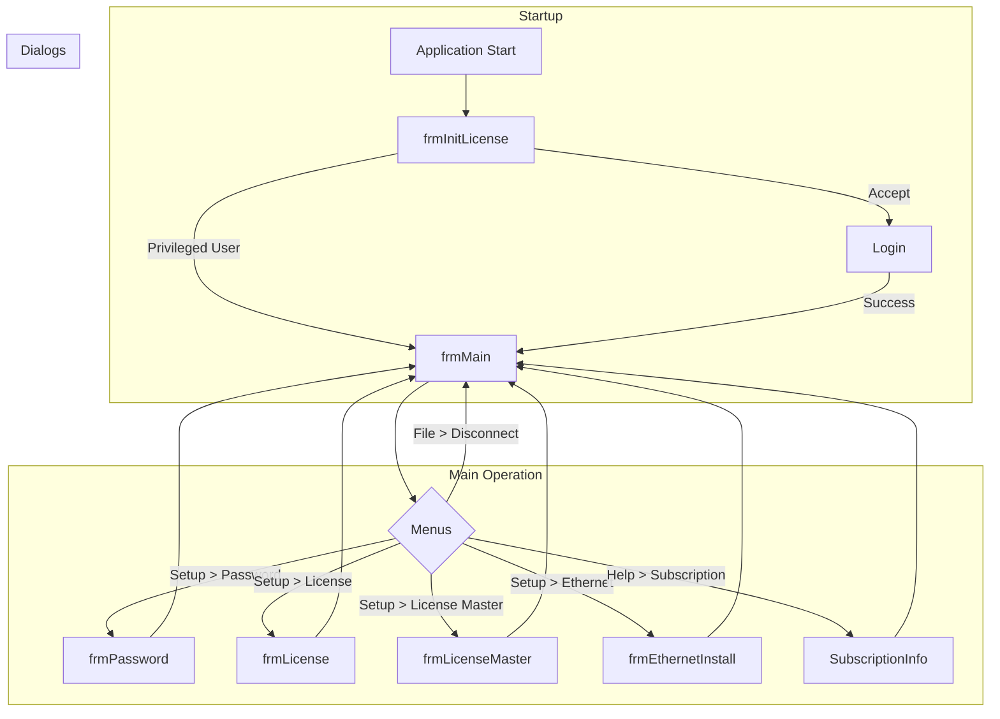
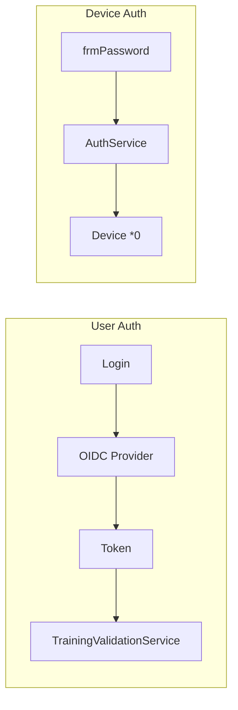
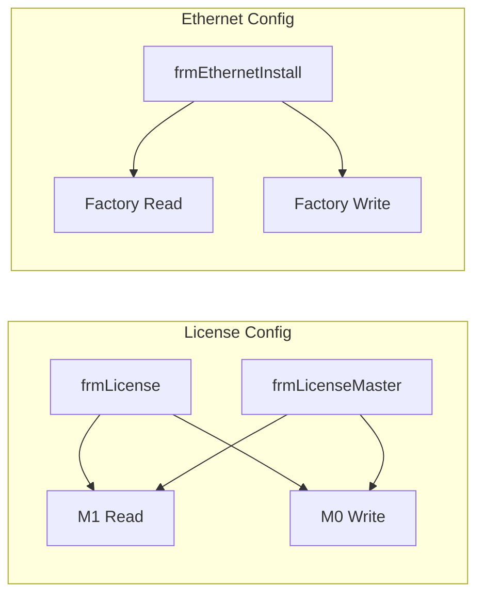

# Forms Index

## Overview

The application consists of 14 WinForms forms organized by functionality:

## Form Catalog

### Main Navigation

| Form | File | Description |
|------|------|-------------|
| **frmMain** | `frmMain.cs` | Main window with WebView2, menus, device connection |
| **Login** | `Login.cs` | OIDC authentication with Azure AD/Firebase |
| **SubscriptionInfo** | `SubscriptionInfo.cs` | Subscription and CLSS training information |

### Device Configuration

| Form | File | Description |
|------|------|-------------|
| **frmPassword** | `frmPassword.cs` | Device password capture/change |
| **frmLicense** | `frmLicense.cs` | Hardware licenses (2 bands) |
| **frmLicenseMaster** | `frmLicenseMaster.cs` | Hardware licenses (4 bands) |
| **frmEthernetInstall** | `frmEthernetInstall.cs` | Ethernet Rabbit module configuration |

### License and Terms

| Form | File | Description |
|------|------|-------------|
| **frmInitLicense** | `frmInitLicense.cs` | IFC 510.5.3 terms and conditions |
| **frmLicenseKey** | `frmLicenseKey.cs` | Hardware license key entry |
| **LicenseKeyDialog** | `LicenseKeyDialog.cs` | License key dialog |

### Utilities

| Form | File | Description |
|------|------|-------------|
| **frmMessage** | `frmMessage.cs` | Progress dialog for long operations |

## Navigation Diagram



## Forms by Device Type

| TDev | Forms Available |
|------|-----------------|
| 1c, 2c | frmLicense, frmPassword, frmEthernetInstall |
| 5dm, 5pm | frmLicenseMaster, frmPassword, frmEthernetInstall |
| All | frmMain, Login, SubscriptionInfo, frmMessage |

## Forms by Functionality

### Authentication and Authorization



### Hardware Configuration



## Common Form Patterns

### Dependency Injection

All forms receive dependencies via constructor:

```csharp
public frmExample(
    ISerialCommandPipeline pipeline,
    ILogger<frmExample> logger)
{
    _pipeline = pipeline;
    _logger = logger;
    InitializeComponent();
}
```

### Loading Pattern

```csharp
private bool _isLoading;
private bool _isLoaded;

protected override async void OnActivated(EventArgs e)
{
    if (_isLoading || _isLoaded) return;
    
    _isLoading = true;
    try
    {
        await LoadDataAsync();
        _isLoaded = true;
    }
    finally
    {
        _isLoading = false;
    }
}
```

### Resource Cleanup

```csharp
protected override void OnFormClosing(FormClosingEventArgs e)
{
    _cts?.Cancel();
    _cts?.Dispose();
    base.OnFormClosing(e);
}
```

## Statistics

| Metric | Value |
|--------|-------|
| Total Forms | 14 |
| Modal Dialogs | 10 |
| Non-Modal Forms | 4 |
| Average Lines per Form | ~350 |
| Total Code Lines (Forms) | ~4,900 |

---

**Previous**: [Technical Dependencies](../20-solution-and-projects/technical-dependencies.md) | **Next**: [frmMain](./frmMain.md)
