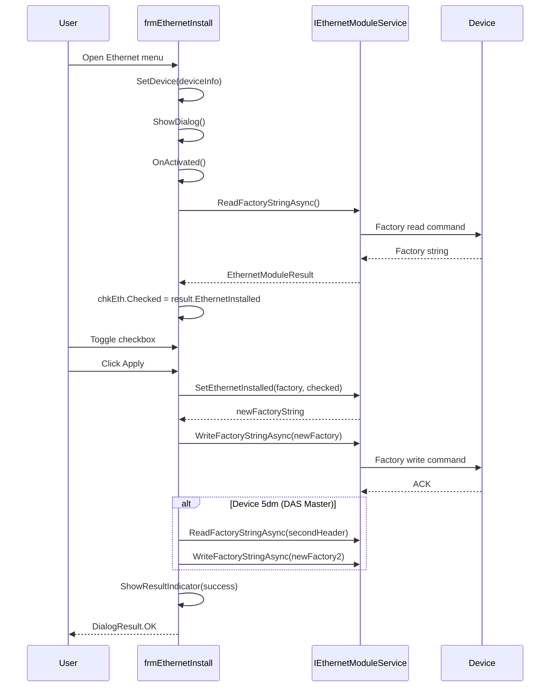

# frmEthernetInstall - Rabbit Ethernet Module

## General Information

| Attribute | Value |
|-----------|-------|
| **File** | `Forms/frmEthernetInstall.cs` |
| **Namespace** | `Fiplex.Control.Software.WinForms.Forms` |
| **Type** | Modal Dialog |
| **Lines of Code** | ~319 |

## Purpose

Dialog for activating or deactivating the Rabbit Ethernet module in Fiplex devices. Modifies **bit 7** of position 93-94 of the device's factory string.

## Technical Context

The Rabbit Ethernet module enables network connectivity for:
- Remote SNMP monitoring
- Web configuration interface
- NOC system integration

## Injected Dependencies

| Service | Interface | Purpose |
|---------|-----------|---------|
| `_ethernetService` | `IEthernetModuleService` | Read/write factory string |
| `_logger` | `ILogger<frmEthernetInstall>` | Logging |

## Execution Flow



## Result Model

```csharp
public class EthernetModuleResult
{
    public bool IsSuccess { get; set; }
    public string FactoryString { get; set; }
    public bool EthernetInstalled { get; set; }
    public bool CommonUl { get; set; }
    public string? ErrorMessage { get; set; }
}
```

## Special Logic for DAS Master (5dm)

DAS Master devices (TDev=5dm) require **two writes** of the factory string:

```csharp
// First write
string? header = _device?.TDev == "5dm"
    ? (_isCommonUl ? "00" : "01")
    : null;

await _ethernetService.WriteFactoryStringAsync(newFactoryString, header);

// Second write (5dm only)
if (_device?.TDev == "5dm")
{
    var secondHeader = _isCommonUl ? "01" : "00";
    var result2 = await _ethernetService.ReadFactoryStringAsync(secondHeader);

    if (result2.IsSuccess)
    {
        var newFactoryString2 = _ethernetService.SetEthernetInstalled(
            result2.FactoryString,
            chkEth.Checked);
        await _ethernetService.WriteFactoryStringAsync(newFactoryString2, secondHeader);
    }
}
```

## UI Controls

| Control | Type | Purpose |
|---------|------|---------|
| `chkEth` | CheckBox | Toggle Ethernet installed |
| `cmdApply` | Button | Apply changes |
| `pctOK` | PictureBox | Success indicator (✓) |
| `pctKO` | PictureBox | Error indicator (✗) |

## Main Methods

### SetDevice(DeviceInfo device)

```csharp
/// <summary>
/// Configures the current device.
/// Must be called before ShowDialog().
/// </summary>
public void SetDevice(DeviceInfo device)
{
    _device = device;
    _logger.LogDebug("Device configured: {Device}", device.NameTypeDevice);
}
```

### LoadFactoryParametersAsync()

```csharp
private async Task LoadFactoryParametersAsync()
{
    var result = await _ethernetService.ReadFactoryStringAsync();

    if (!result.IsSuccess)
    {
        // Show error and close
        MessageBox.Show("Error retrieving device information", ...);
        Close();
        return;
    }

    _factoryString = result.FactoryString;
    _isCommonUl = result.CommonUl;
    chkEth.Checked = result.EthernetInstalled;
}
```

### ShowResultIndicator(bool success)

```csharp
private async void ShowResultIndicator(bool success)
{
    pctOK.Visible = success;
    pctKO.Visible = !success;

    await Task.Delay(2000);  // Show indicator for 2 seconds

    pctOK.Visible = false;
    pctKO.Visible = false;

    if (success)
    {
        DialogResult = DialogResult.OK;
        Close();
    }
}
```

## Async Operations Management

```csharp
private bool _isLoading;
private bool _isApplying;
private CancellationTokenSource? _cts;

// Avoid multiple reloads
if (_isLoading || !string.IsNullOrEmpty(_factoryString))
    return;

// Avoid multiple operations
if (_isApplying)
    return;
```

## Resource Cleanup

```csharp
protected override void OnFormClosing(FormClosingEventArgs e)
{
    CancelPendingOperations();
    base.OnFormClosing(e);
}

private void CancelPendingOperations()
{
    try
    {
        if (_cts != null && !_cts.IsCancellationRequested)
        {
            _cts.Cancel();
        }
    }
    catch (ObjectDisposedException)
    {
        // CTS already disposed, ignore
    }
}
```

## Access from frmMain

```csharp
// In frmMain.cs
private void mnuEthernet_Click(object sender, EventArgs e)
{
    using var dialog = _serviceProvider.GetRequiredService<frmEthernetInstall>();
    dialog.SetDevice(_currentDevice);

    if (dialog.ShowDialog(this) == DialogResult.OK)
    {
        WebRefresh(true);  // Refresh UI
    }
}
```

## Supported Devices

| TDev | Name | Special Handling |
|------|------|------------------|
| 1c | Signal Booster | No |
| 2c | Signal Booster | No |
| 5dm | DAS Master | Yes (dual factory) |
| 5pm | PSC Master | Yes (dual factory) |

---

**Previous**: [frmLicenseMaster](./frmLicenseMaster.md) | **Next**: [frmMessage](./frmMessage.md)
