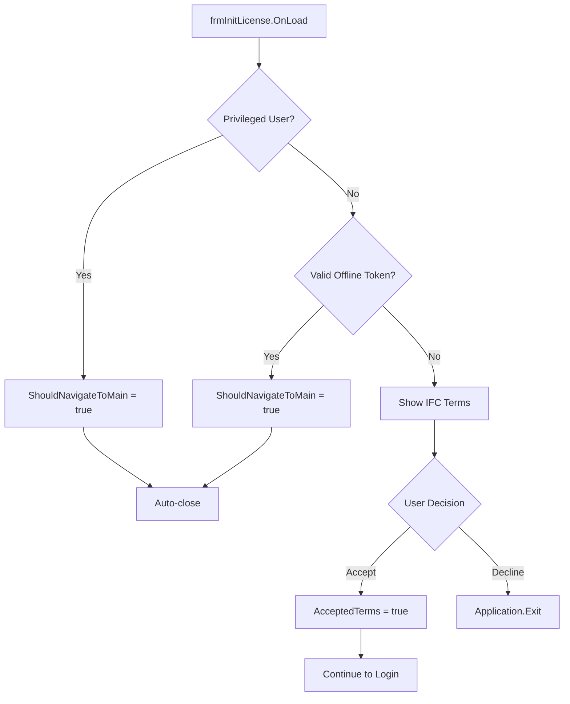

# frmInitLicense - Terms and Conditions

## General Information

| Attribute | Value |
|-----------|-------|
| **File** | `Forms/frmInitLicense.cs` |
| **Namespace** | `Fiplex.Control.Software.WinForms.Forms` |
| **Type** | Flow Form |
| **Lines of Code** | ~379 |

## Purpose

License terms and conditions form displayed before accessing the main application. Validates:

1. **IFC 510.5.3 terms acceptance** for ERCES/BDA
2. **Privileged users** (calibration stations)
3. **Valid offline tokens** (previous sessions)

## IFC 510.5.3 Requirements

The form displays IFC (International Fire Code) requirements for ERCES/BDA systems:

1. Valid GROL (General Radio Operator's License)
2. In-building ERCES/BDA training certification from Fiplex by Honeywell

## Injected Dependencies

| Service | Interface | Purpose |
|---------|-----------|---------|
| `_privilegedUserService` | `IPrivilegedUserService` | Validates privileged users |
| `_tokenValidator` | `IOfflineTokenValidator` | Validates offline tokens |
| `_serviceProvider` | `IServiceProvider` | Dependency resolution |
| `_logger` | `ILogger<frmInitLicense>` | Logging |

## Public Properties

| Property | Type | Description |
|----------|------|-------------|
| `AcceptedTerms` | `bool` | User accepted terms |
| `ShouldNavigateToMain` | `bool` | Navigate directly to frmMain |
| `PrivilegedPassword` | `string?` | Privileged user password |

## Decision Flow



## Terms Text

```
USER REPRESENTS THAT HE/SHE HAS THE MINIMUM QUALIFICATIONS LISTED BELOW,
WHICH ARE REQUIRED BY CODE (IFC 510.5.3) FOR DESIGN AND INSTALLATION OF
EMERGENCY RESPONDER COMMUNICATION ENHANCEMENT SYSTEMS ("ERCES") OR
BI-DIRECTIONAL AMPLIFICATION ("BDA") SYSTEMS:

    1.  Valid FCC-issued General Radio Operator's License ("GROL"), and
    2.  Certification of in-building ERCES/BDA training from Fiplex by Honeywell
        or another approved organization or school.

By clicking Accept, you confirm that you meet these qualifications.
```

## Main Methods

### OnLoad - Privileged User Validation

```csharp
protected override async void OnLoad(EventArgs e)
{
    base.OnLoad(e);
    _cts = new CancellationTokenSource();

    try
    {
        var (isValid, password) = await _privilegedUserService
            .ValidatePrivilegedUserAsync();

        _isPrivilegedUser = isValid;
        PrivilegedPassword = password;

        if (_isPrivilegedUser)
        {
            _logger.LogInformation("Privileged user detected");
        }
    }
    catch (Exception ex)
    {
        _logger.LogError(ex, "Error validating privileged user");
        _isPrivilegedUser = false;
    }
    finally
    {
        _validationCompleted = true;
    }
}
```

### OnActivated - Automatic Navigation

```csharp
protected override void OnActivated(EventArgs e)
{
    base.OnActivated(e);

    // Wait for validation to complete
    if (!_validationCompleted || _autoNavigationProcessed)
        return;

    _autoNavigationProcessed = true;

    if (_isPrivilegedUser)
    {
        ShouldNavigateToMain = true;
        Close();
        return;
    }

    // Check for valid offline token
    if (_tokenValidator.HasValidOfflineToken())
    {
        ShouldNavigateToMain = true;
        Close();
        return;
    }

    // Show terms to standard user
}
```

### Button Events

```csharp
private void btnAccept_Click(object sender, EventArgs e)
{
    AcceptedTerms = true;
    Close();
}

private void btnDecline_Click(object sender, EventArgs e)
{
    AcceptedTerms = false;
    Application.Exit();
}
```

### IFC Codes Link

```csharp
private const string IFC_CODES_URL =
    "https://codes.iccsafe.org/content/IFC2021P2/chapter-5-fire-service-features#IFC2021P2_Pt03_Ch05_Sec510.5.3";

private void linkTerms_LinkClicked(object sender, LinkLabelLinkClickedEventArgs e)
{
    Process.Start(new ProcessStartInfo
    {
        FileName = IFC_CODES_URL,
        UseShellExecute = true
    });
}
```

## Application Flow Integration

```csharp
// In Program.cs or frmMain
var initLicense = _serviceProvider.GetRequiredService<frmInitLicense>();
initLicense.ShowDialog();

if (initLicense.ShouldNavigateToMain)
{
    // Privileged user or valid token → direct to frmMain
    ShowMainForm(initLicense.PrivilegedPassword);
}
else if (initLicense.AcceptedTerms)
{
    // Terms accepted → OIDC Login
    ShowLoginForm();
}
else
{
    // Terms declined → Exit
    Application.Exit();
}
```

## Privileged Users

Privileged users are calibration stations identified by:
- Specific MAC address
- Local configuration file
- Environment variables

```csharp
public interface IPrivilegedUserService
{
    Task<(bool IsValid, string? Password)> ValidatePrivilegedUserAsync();
}
```

## Race Condition Control

```csharp
// Flags to avoid race conditions between OnLoad and OnActivated
private bool _validationCompleted;
private bool _autoNavigationProcessed;
```

## Visual Layout

```
┌──────────────────────────────────────────────────┐
│  [Fiplex Logo]                                   │
├──────────────────────────────────────────────────┤
│                                                  │
│  USER REPRESENTS THAT HE/SHE HAS THE MINIMUM     │
│  QUALIFICATIONS LISTED BELOW, WHICH ARE          │
│  REQUIRED BY CODE (IFC 510.5.3) FOR DESIGN...    │
│                                                  │
│      1. Valid FCC-issued General Radio           │
│         Operator's License ("GROL"), and         │
│                                                  │
│      2. Certification of in-building ERCES/BDA   │
│         training from Fiplex by Honeywell...     │
│                                                  │
│  By clicking Accept, you confirm that you meet   │
│  these qualifications.                           │
│                                                  │
│         [Accept]        [Decline]                │
│                                                  │
└──────────────────────────────────────────────────┘
```

---

**Previous**: [frmMessage](./frmMessage.md) | **Next**: [frmLicenseKey](./frmLicenseKey.md)
