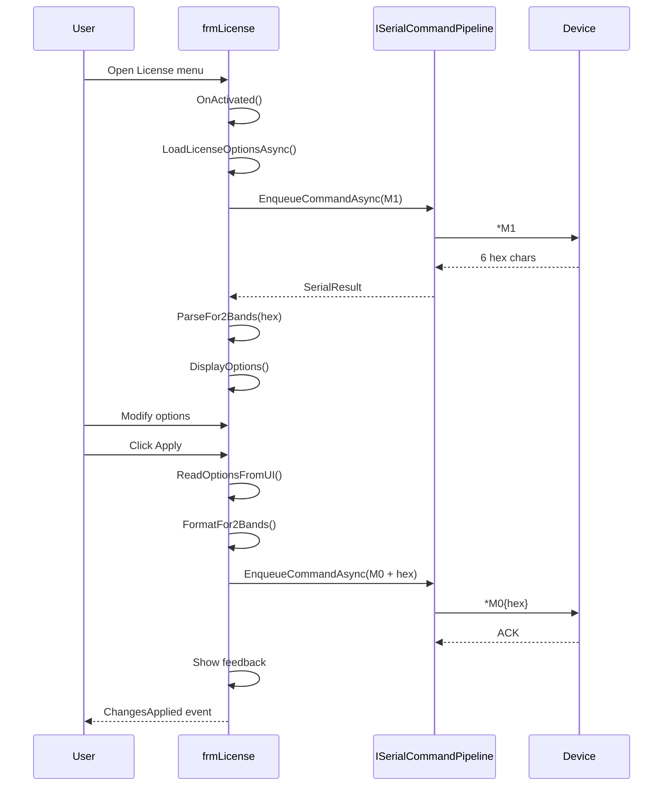

# frmLicense - License Configuration (2 Bands)

## General Information

| Attribute | Value |
|-----------|-------|
| **File** | `Forms/frmLicense.cs` |
| **Namespace** | `Fiplex.Control.Software.WinForms.Forms` |
| **Type** | Modal Dialog |
| **Lines of Code** | ~557 |

## Purpose

Form for configuring hardware license options on **2-band** devices (standard Signal Boosters). Allows enabling/disabling:

- Narrow Bandwidth filters
- Adjacent Bandwidth filters
- Single-band mode
- Downlink power limits

## Serial Commands

| Command | Direction | Description |
|---------|-----------|-------------|
| `M1` | Read | Reads current options (6 hex chars) |
| `M0` | Write | Writes new options (6 hex chars) |

### Hexadecimal Format (6 characters)

```
[1-2] mask:       bit0=chEnabled[0], bit1=adjEnabled[0]
                  bit2=chEnabled[1], bit3=adjEnabled[1]
                  bit4=singleEnabled[0], bit5=singleEnabled[1]
[3-4] powerDL[0]: Signed byte (-128..127)
[5-6] powerDL[1]: Signed byte (-128..127)
```

## Injected Dependencies

| Service | Interface | Purpose |
|---------|-----------|---------|
| `_pipeline` | `ISerialCommandPipeline` | Serial communication |
| `_logger` | `ILogger<frmLicense>` | Logging |

## Control Structure

### Control Arrays (VB6 Pattern)

```csharp
// Equivalent to VB6 control arrays
private CheckBox[] _chkNarrow = [chkNbEn0, chkNbEn1];
private CheckBox[] _chkAdjBw = [chkAdjEn0, chkAdjEn1];
private CheckBox[] _chkSingle = [chkSingEn0, chkSingEn1];
private TextBox[] _txtPowerDL = [txtPowDL0, txtPowDL1];
```

| Index | Band | Typical Frequencies |
|-------|------|---------------------|
| 0 | BAND0 | 700 MHz / VHF |
| 1 | BAND1 | 800 MHz / UHF |

## Execution Flow



## Data Model

```csharp
public class LicenseOptions
{
    public bool[] NarrowFiltersEnabled { get; } = new bool[2];
    public bool[] AdjBwFiltersEnabled { get; } = new bool[2];
    public bool[] SingleBandEnabled { get; } = new bool[2];
    public short[] PowerLimitDownlink { get; } = new short[2];
}
```

## Input Validation

### PowerDL Validation

```csharp
// KeyPress: Only digits and negative sign at start
private void TxtPowerDL_KeyPress(object? sender, KeyPressEventArgs e)
{
    if (!char.IsDigit(e.KeyChar) && e.KeyChar != '\b')
    {
        if (e.KeyChar == '-' && sender is TextBox txt && txt.SelectionStart == 0)
            return; // Allow negative at start
        e.Handled = true;
    }
}

// Validating: Clamp to signed byte range
private void TxtPowerDL_Validating(...)
{
    value = Math.Clamp(value, (short)-128, (short)127);
}
```

## Main Methods

### ParseFor2Bands(string hex)

Converts 6-character hex response to `LicenseOptions`:

```csharp
// Byte 1: Bit mask
// - bit0: NarrowEnabled[0]
// - bit1: AdjBwEnabled[0]
// - bit2: NarrowEnabled[1]
// - bit3: AdjBwEnabled[1]
// - bit4: SingleEnabled[0]
// - bit5: SingleEnabled[1]

// Bytes 2-3: PowerDL[0] (signed)
// Bytes 4-5: PowerDL[1] (signed)
```

### FormatFor2Bands()

Converts `LicenseOptions` to 6-character hex for M0 command.

## ChangesApplied Event

```csharp
/// <summary>
/// Allows frmMain to execute WebRefresh(True) after applying changes.
/// </summary>
public event EventHandler? ChangesApplied;

// In cmdApply_Click:
if (result.Success)
{
    ChangesApplied?.Invoke(this, EventArgs.Empty);
}
```

## Constants

```csharp
private const int ExpectedHexLength = 6;
private const int FeedbackDelayMs = 2000;
private const int CommandTimeoutMs = 5000;
```

## Resource Management

```csharp
protected override void OnFormClosing(FormClosingEventArgs e)
{
    _cts?.Cancel();
    _cts?.Dispose();

    // Unsubscribe validation events
    foreach (var txt in _txtPowerDL)
    {
        txt.KeyPress -= TxtPowerDL_KeyPress;
        txt.Validating -= TxtPowerDL_Validating;
    }

    base.OnFormClosing(e);
}
```

## Differences with frmLicenseMaster

| Aspect | frmLicense | frmLicenseMaster |
|--------|------------|------------------|
| Bands | 2 | 4 |
| Hex Length | 6 chars | 10+ chars |
| Boot Firmware | No | Yes (combo) |
| Parser | Internal | `LicenseOptionsParser` |
| Devices | Signal Booster | DAS Master |

---

**Previous**: [SubscriptionInfo](./SubscriptionInfo.md) | **Next**: [frmLicenseMaster](./frmLicenseMaster.md)
