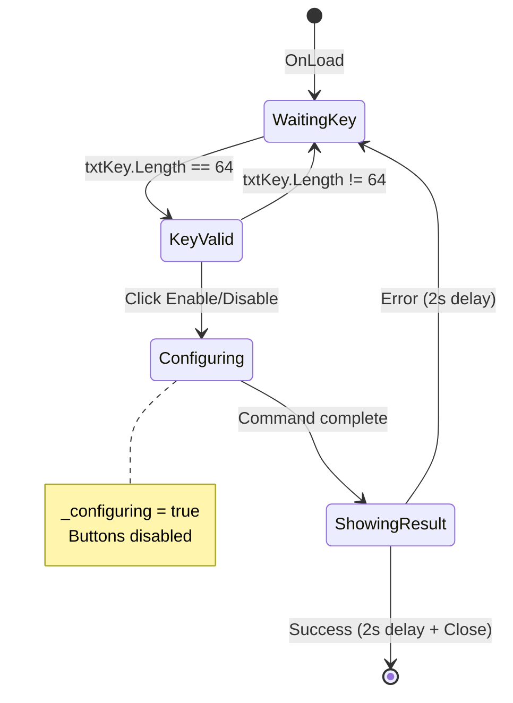

# frmLicenseKey - Hardware License Key

## General Information

| Attribute | Value |
|-----------|-------|
| **File** | `Forms/frmLicenseKey.cs` |
| **Namespace** | `Fiplex.Control.Software.WinForms.Forms` |
| **Type** | Modal Dialog |
| **Lines of Code** | ~200 |

## Purpose

Form for writing hardware license keys directly to the device. Allows enabling or disabling specific hardware features using a 64-character hexadecimal key.

## Serial Command

| Command | Format | Description |
|---------|--------|-------------|
| `;0` | `;0{XX}{64_chars_hex}` | Sends license key |

### Command Parameters

| Position | Content | Description |
|----------|---------|-------------|
| `;0` | Prefix | License command identifier |
| `{XX}` | Index hex | `00`=Disable, `01`=Enable |
| `{64_chars}` | Key | 64 hexadecimal characters |

## Injected Dependencies

| Service | Interface | Purpose |
|---------|-----------|---------|
| `_pipeline` | `ISerialCommandPipeline` | Serial communication |
| `_logger` | `ILogger<frmLicenseKey>` | Logging |

## Execution Flow

```mermaid
sequenceDiagram
    participant User
    participant Form as frmLicenseKey
    participant Timer as tmrKey (200ms)
    participant Pipeline as ISerialCommandPipeline
    participant Device

    User->>Form: Open dialog
    Form->>Timer: Start validation

    loop Every 200ms
        Timer->>Form: TmrKey_Tick
        Form->>Form: Validate key length
        alt length == 64
            Form->>Form: Enable buttons
        else length != 64
            Form->>Form: Disable buttons
        end
    end

    User->>Form: Enter key (64 chars)
    User->>Form: Click "Enable Feature"
    Form->>Form: CmdLicense_Click(1)
    Form->>Pipeline: EnqueueCommandAsync(;001{key})
    Pipeline->>Device: ;001{64_chars_hex}
    Device-->>Pipeline: ACK
    Pipeline-->>Form: SerialResult

    alt Success
        Form->>Form: Show pctOK (2s)
        Form->>Form: LicenseApplied event
        Form->>Form: Close()
    else Failure
        Form->>Form: Show pctKO (2s)
    end
```

## UI Controls

| Control | Type | Purpose |
|---------|------|---------|
| `txtKey` | TextBox | Key input (64 chars) |
| `btnEnableFeature` | Button | Enable feature |
| `btnDisableFeature` | Button | Disable feature |
| `pctOK` | PictureBox | Success indicator |
| `pctKO` | PictureBox | Error indicator |
| `tmrKey` | Timer | Periodic validation (200ms) |

## Main Methods

### OnLoad

```csharp
protected override void OnLoad(EventArgs e)
{
    base.OnLoad(e);

    txtKey.Text = string.Empty;
    btnEnableFeature.Enabled = false;
    btnDisableFeature.Enabled = false;

    tmrKey.Interval = 200;
    tmrKey.Enabled = true;
}
```

### TmrKey_Tick - Periodic Validation

```csharp
private void TmrKey_Tick(object? sender, EventArgs e)
{
    if (!_configuring)
    {
        bool keyOk = txtKey.Text.Length == 64;
        btnEnableFeature.Enabled = keyOk;
        btnDisableFeature.Enabled = keyOk;
    }
}
```

### CmdLicense_Click - Command Submission

```csharp
private async void CmdLicense_Click(int index)
{
    if (txtKey.Text.Length != 64)
        return;

    _configuring = true;

    // Format: ;0{xx}{64_chars_hex_key}
    var indexHex = index.ToString("X2");
    var command = new SerialCommand
    {
        Payload = $";0{indexHex}{txtKey.Text}",
        ExpectsAck = true,
        ExpectsData = false
    };

    var result = await _pipeline.EnqueueCommandAsync(command);

    if (result.Success)
    {
        pctOK.Visible = true;
        await Task.Delay(2000);
        LicenseApplied?.Invoke(this, EventArgs.Empty);
        Close();
    }
    else
    {
        pctKO.Visible = true;
        await Task.Delay(2000);
        pctKO.Visible = false;
    }
}
```

## LicenseApplied Event

```csharp
/// <summary>
/// Event fired when license is applied successfully.
/// </summary>
public event EventHandler? LicenseApplied;

// In frmMain:
dialog.LicenseApplied += (s, e) => WebRefresh(true);
```

## Key Validation

| Criteria | Value |
|----------|-------|
| Exact length | 64 characters |
| Valid characters | 0-9, A-F, a-f |
| Validation | Every 200ms by timer |

## Visual Layout

```
┌──────────────────────────────────────────────────┐
│  License Key                                     │
├──────────────────────────────────────────────────┤
│                                                  │
│  Enter 64-character license key:                 │
│                                                  │
│  ┌────────────────────────────────────────────┐  │
│  │ A1B2C3D4E5F6...                           │  │
│  └────────────────────────────────────────────┘  │
│                                                  │
│  [Enable Feature]    [Disable Feature]           │
│                                                  │
│           [OK ✓]  [KO ✗]  (hidden)              │
│                                                  │
└──────────────────────────────────────────────────┘
```

## Resource Management

```csharp
protected override void OnFormClosing(FormClosingEventArgs e)
{
    _cts?.Cancel();
    _cts?.Dispose();
    _cts = null;

    tmrKey.Enabled = false;

    base.OnFormClosing(e);
}
```

## Form States



## Use Cases

1. **Enable premium feature**: Enter key → Click "Enable Feature"
2. **Disable feature**: Enter key → Click "Disable Feature"
3. **Invalid key**: KO indicator for 2 seconds, retry

## Access from frmMain

```csharp
private void mnuLicenseKey_Click(object sender, EventArgs e)
{
    using var dialog = _serviceProvider.GetRequiredService<frmLicenseKey>();
    dialog.LicenseApplied += (s, e) => WebRefresh(true);
    dialog.ShowDialog(this);
}
```

---

**Previous**: [frmInitLicense](./frmInitLicense.md) | **Next**: [Forms Index](./forms-index.md)
