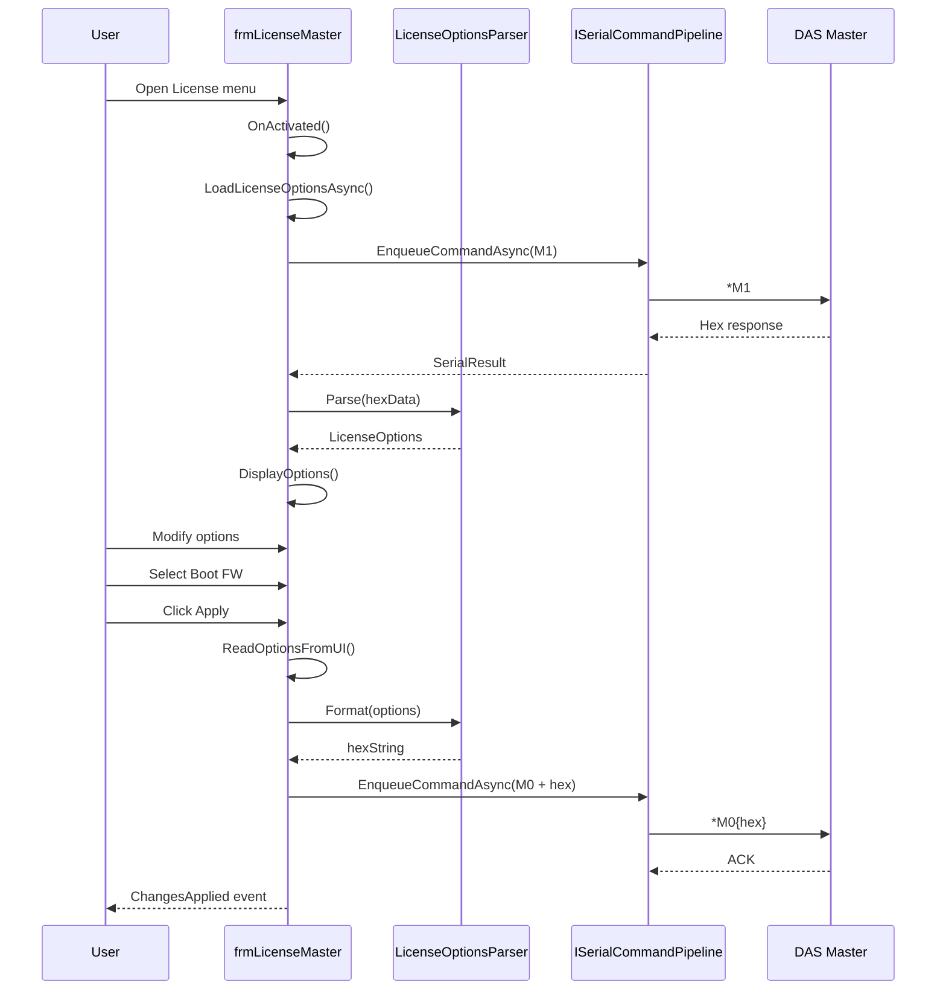

# frmLicenseMaster - Multi-Band License Configuration

## General Information

| Attribute | Value |
|-----------|-------|
| **File** | `Forms/frmLicenseMaster.cs` |
| **Namespace** | `Fiplex.Control.Software.WinForms.Forms` |
| **Type** | Modal Dialog |
| **Lines of Code** | ~436 |

## Purpose

Form for configuring hardware license options on **multi-band** devices (DAS Master, PSC). Supports 4 simultaneous bands and boot firmware selection.

## Supported Bands

| Index | Identifier | Frequency |
|-------|------------|-----------|
| 0 | FW0 BAND0 | 700 MHz |
| 1 | FW0 BAND1 | 800 MHz |
| 2 | FW1 BAND0 | VHF |
| 3 | FW1 BAND1 | UHF |

## Serial Commands

| Command | Direction | Description |
|---------|-----------|-------------|
| `M1` | Read | Reads current options |
| `M0` | Write | Writes new options |

## Injected Dependencies

| Service | Interface | Purpose |
|---------|-----------|---------|
| `_pipeline` | `ISerialCommandPipeline` | Serial communication |
| `_parser` | `LicenseOptionsParser` | Specialized parser |
| `_logger` | `ILogger<frmLicenseMaster>` | Logging |

## Control Structure

### Control Arrays (4 bands)

```csharp
// Order: [700, 800, VHF, UHF] = indices [0, 1, 2, 3]
_chkNarrow = [chkNbEn0, chkNbEn1, chkNbEn2, chkNbEn3];
_chkAdjBw = [chkAdjEn0, chkAdjEn1, chkAdjEn2, chkAdjEn3];
_chkSingle = [chkSingEn0, chkSingEn1, chkSingEn2, chkSingEn3];
_txtPowerDL = [txtPowDL0, txtPowDL1, txtPowDL2, txtPowDL3];
```

### Boot Firmware ComboBox

```csharp
// cmbBoot: Boot firmware selection
// Index 0 = FW0 (700/800 MHz)
// Index 1 = FW1 (VHF/UHF)
```

## Execution Flow



## Data Model

```csharp
public class LicenseOptions
{
    public const int NumBands = 4;

    public bool[] NarrowFiltersEnabled { get; } = new bool[NumBands];
    public bool[] AdjBwFiltersEnabled { get; } = new bool[NumBands];
    public bool[] SingleBandEnabled { get; } = new bool[NumBands];
    public short[] PowerLimitDownlink { get; } = new short[NumBands];
    public short BootFirmware { get; set; } // 0 or 1
}
```

## Input Validation

Identical to `frmLicense`:

```csharp
// Valid range for PowerDL: -128 to 127 (signed byte)
value = Math.Clamp(value, (short)-128, (short)127);
```

## LicenseOptionsParser

Separate class for multi-band options parsing/formatting:

```csharp
public class LicenseOptionsParser
{
    public LicenseOptions Parse(string hexData)
    {
        // Decodes master device-specific format
    }

    public string Format(LicenseOptions options)
    {
        // Encodes to hex format for M0 command
    }
}
```

## Main Methods

### DisplayOptions(LicenseOptions options)

```csharp
private void DisplayOptions(LicenseOptions options)
{
    for (int i = 0; i < LicenseOptions.NumBands; i++)
    {
        _chkNarrow[i].Checked = options.NarrowFiltersEnabled[i];
        _chkAdjBw[i].Checked = options.AdjBwFiltersEnabled[i];
        _chkSingle[i].Checked = options.SingleBandEnabled[i];
        _txtPowerDL[i].Text = options.PowerLimitDownlink[i].ToString();
    }

    cmbBoot.SelectedIndex = Math.Clamp(options.BootFirmware, (short)0, (short)1);
}
```

### ReadOptionsFromUI()

```csharp
private LicenseOptions ReadOptionsFromUI()
{
    var options = new LicenseOptions();

    for (int i = 0; i < LicenseOptions.NumBands; i++)
    {
        options.NarrowFiltersEnabled[i] = _chkNarrow[i].Checked;
        options.AdjBwFiltersEnabled[i] = _chkAdjBw[i].Checked;
        options.SingleBandEnabled[i] = _chkSingle[i].Checked;
        options.PowerLimitDownlink[i] = ParsePowerValue(_txtPowerDL[i].Text);
    }

    options.BootFirmware = (short)Math.Max(0, cmbBoot.SelectedIndex);
    return options;
}
```

## Lifecycle Management

```csharp
// Avoid multiple loads
private bool _isLoading;
private bool _isLoaded;

protected override async void OnActivated(EventArgs e)
{
    if (_isLoading || _isLoaded) return;

    _isLoading = true;
    try
    {
        await LoadLicenseOptionsAsync();
        _isLoaded = true;
    }
    finally
    {
        _isLoading = false;
    }
}
```

## Visual Layout

```
┌──────────────────────────────────────────────────┐
│  License Options - Master (4 Bands)              │
├──────────────────────────────────────────────────┤
│                                                  │
│  Band    Narrow   AdjBW   Single   PowerDL      │
│  ─────   ──────   ─────   ──────   ────────     │
│  700MHz  [✓]      [✓]     [ ]      [-5    ]     │
│  800MHz  [✓]      [ ]     [ ]      [-3    ]     │
│  VHF     [ ]      [✓]     [✓]      [0     ]     │
│  UHF     [✓]      [✓]     [ ]      [-8    ]     │
│                                                  │
│  Boot Firmware: [FW0 (700/800) ▼]               │
│                                                  │
│              [Apply]    [Cancel]                 │
└──────────────────────────────────────────────────┘
```

## Compatible Devices

| TDev | Name | Bands |
|------|------|-------|
| 5dm | DAS Master | 4 |
| 5pm | PSC Master | 4 |

## ChangesApplied Event

```csharp
public event EventHandler? ChangesApplied;

// Notifies frmMain to refresh WebView
ChangesApplied?.Invoke(this, EventArgs.Empty);
```

---

**Previous**: [frmLicense](./frmLicense.md) | **Next**: [frmEthernetInstall](./frmEthernetInstall.md)
