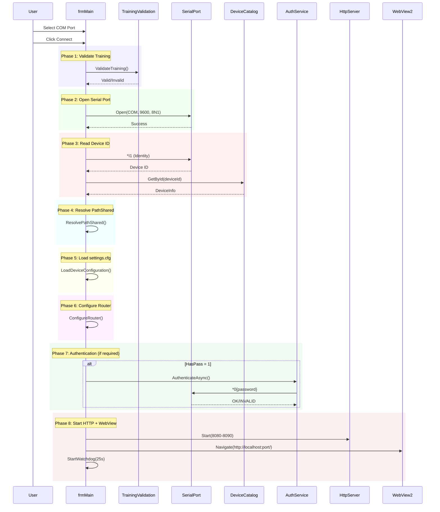
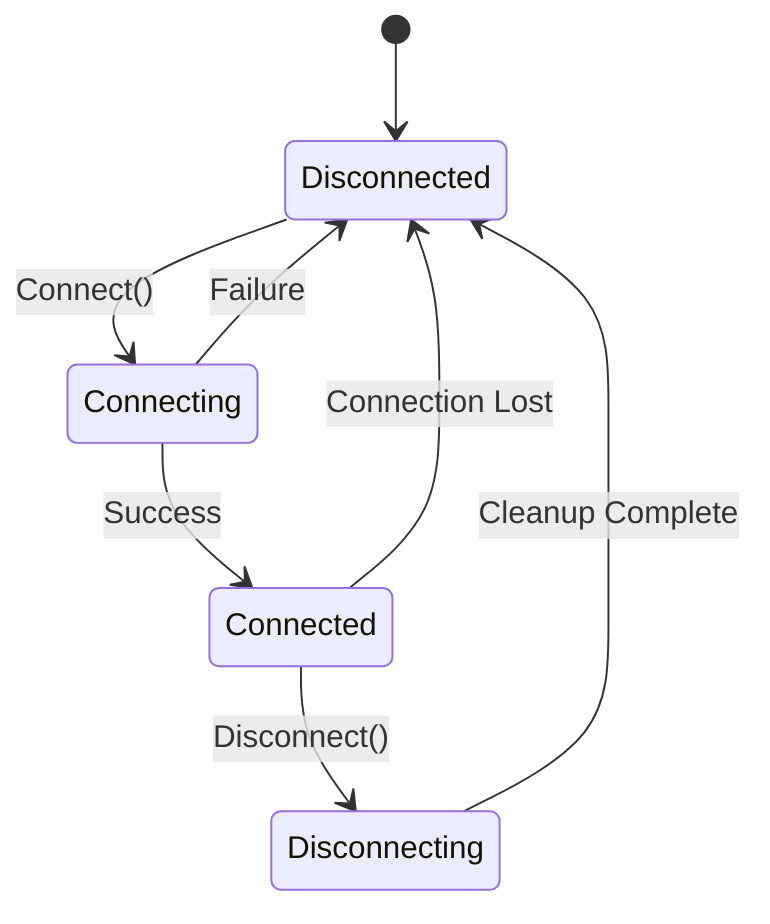

# frmMain - Main Form

## General Information

| Attribute | Value |
|-----------|-------|
| **File** | `Forms/frmMain.cs` |
| **Namespace** | `Fiplex.Control.Software.WinForms.Forms` |
| **Type** | Main MDI Form |
| **Lines of Code** | ~4,316 |

## Purpose

Main application form that orchestrates:
- Serial device connection
- WebView2 for HTML UI rendering
- Embedded HTTP server
- Dynamic menus per device
- File operations (calibration, configuration)

## Injected Dependencies

| Service | Interface | Purpose |
|---------|-----------|---------|
| `_pipeline` | `ISerialCommandPipeline` | Serial command queue |
| `_router` | `IDeviceCommandRouter` | HTTP→Serial routing |
| `_httpServer` | `IEmbeddedHttpServer` | Embedded HTTP server |
| `_deviceCatalog` | `IDeviceCatalogService` | Device catalog |
| `_authService` | `IAuthService` | Device authentication |
| `_configService` | `IConfigService` | Configuration service |
| `_calibrationService` | `ICalibrationService` | Calibration service |
| `_trainingValidation` | `ITrainingValidationService` | Training validation |
| `_watchdog` | `IWatchdogService` | Device keepalive |
| `_settingsParser` | `ISettingsParser` | settings.cfg parser |
| `_fileOperationService` | `IFileOperationService` | File operations |
| `_factoryService` | `IFactoryParametersService` | Factory parameters |
| `_logger` | `ILogger<frmMain>` | Structured logging |
| `_serviceProvider` | `IServiceProvider` | Dependency resolution |

## Connection Flow (8 Phases)



## Main Areas

### WebView2

```csharp
private async Task InitializeWebViewAsync()
{
    var env = await CoreWebView2Environment.CreateAsync();
    await webView.EnsureCoreWebView2Async(env);
    
    webView.CoreWebView2.WebResourceRequested += OnWebResourceRequested;
    webView.CoreWebView2.NavigationCompleted += OnNavigationCompleted;
}
```

### Dynamic Menu

```csharp
private void ConfigureMenusForDevice(DeviceInfo device)
{
    // License menu: only if ucVersion >= 0x10B
    mnuLicense.Visible = _ucVersion >= 0x10B;
    
    // Password menu: only if HasPass = 1
    mnuPassword.Visible = device.HasPass == 1;
    
    // Calibration menu: only for certain device types
    mnuCal.Visible = CalibrationSupportedForDevice(device.TDev);
}
```

### Watchdog

```csharp
private void StartWatchdog()
{
    _watchdogTimer = new System.Timers.Timer(25000);
    _watchdogTimer.Elapsed += async (s, e) =>
    {
        var result = await _pipeline.EnqueueCommandAsync(new SerialCommand
        {
            Payload = "W1",  // Watchdog ping
            ExpectsAck = true,
            ExpectsData = false
        });
        
        if (!result.Success)
        {
            HandleConnectionLost();
        }
    };
    _watchdogTimer.Start();
}
```

## Connection States



## Main Events

| Event | Source | Action |
|-------|--------|--------|
| `CommandCompleted` | Pipeline | Update UI status |
| `CredentialsRequired` | Pipeline | Show frmPassword |
| `BaseJsLoaded` | HttpServer | Clear pending commands |
| `NavigationCompleted` | WebView2 | Enable menus |

## Main Menus

| Menu | Options |
|------|---------|
| **File** | Connect, Disconnect, Exit |
| **Setup** | Password, License, Ethernet, Factory Default |
| **Calibration** | Load, Save, Apply |
| **Configuration** | Load, Save, Apply |
| **Help** | Subscription Info, About |

## File Operations

### Calibration (.calr)

```csharp
private async Task SaveCalibrationAsync(string filePath)
{
    using var progress = new frmMessage();
    progress.SetMessage("Saving Calibration");
    progress.Show();
    
    try
    {
        await _calibrationService.SaveToFileAsync(filePath);
    }
    finally
    {
        progress.CloseProgress();
    }
}
```

### Configuration (.cfgr)

```csharp
private async Task LoadConfigurationAsync(string filePath)
{
    using var progress = new frmMessage();
    progress.SetMessage("Loading Configuration");
    progress.Show();
    
    try
    {
        await _configService.LoadFromFileAsync(filePath);
        WebRefresh(true);
    }
    finally
    {
        progress.CloseProgress();
    }
}
```

## ucVersion Logic

```csharp
// Extracted from V1 response
private int _ucVersion;

// Determines feature availability
if (_ucVersion >= 0x10B)  // Version 1.11+
{
    mnuLicense.Visible = true;
    mnuLicenseKey.Visible = true;
}
```

---

**Previous**: [Forms Index](./forms-index.md) | **Next**: [Login](./Login.md)
