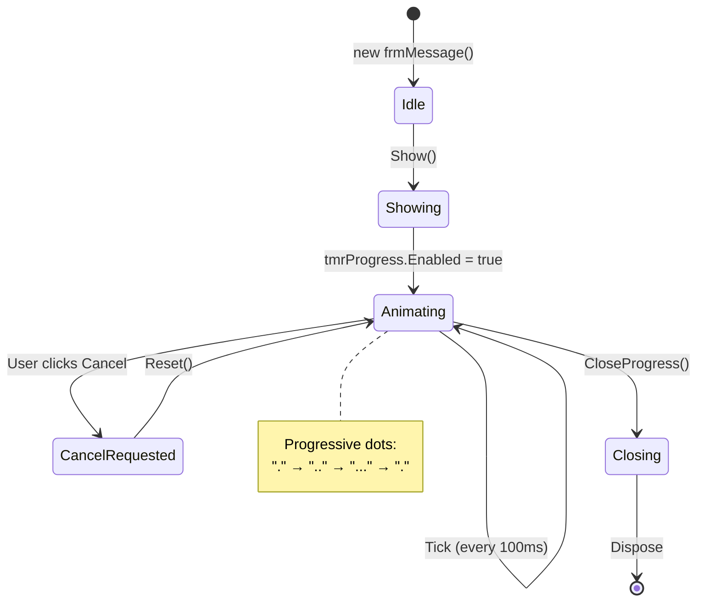

# frmMessage - Progress Dialog

## General Information

| Attribute | Value |
|-----------|-------|
| **File** | `Forms/frmMessage.cs` |
| **Namespace** | `Fiplex.Control.Software.WinForms.Forms` |
| **Type** | Non-Modal Dialog |
| **Lines of Code** | ~366 |

## Purpose

Reusable progress dialog for lengthy serial operations. Provides visual feedback to the user during:

- Calibration save/load (`.calr`)
- Configuration save/load (`.cfgr`)
- Device configuration application

## Features

| Feature | Description |
|---------|-------------|
| Animation | Progressive dots (100ms timer) |
| TopMost | Forced for visibility |
| Manual close | Prevented (programmatic only) |
| Cancellation | Externally queryable flag |
| Thread-safe | Cross-thread safe methods |

## Usage Pattern

```csharp
// Typical usage from frmMain
using var progress = new frmMessage();
progress.SetMessage("Applying Configuration");
progress.Show();

try
{
    // Lengthy operation
    await ApplyConfigurationAsync();
}
finally
{
    progress.CloseProgress();  // Programmatic close
}
```

## Public Properties

| Property | Type | Description |
|----------|------|-------------|
| `CancelRequested` | `bool` | Queryable cancellation flag |
| `MessageText` | `string` | Main message text |
| `ProgressText` | `string` | Progress indicator text |

## Public Methods

### SetMessage(string message)

```csharp
/// <summary>
/// Updates the main message. Thread-safe.
/// </summary>
public void SetMessage(string message)
{
    if (IsDisposed) return;

    if (InvokeRequired)
    {
        Invoke(() => SetMessage(message));
        return;
    }

    lblMessage.Text = message;
    lblProgress.Text = "";
}
```

### ShowCancelButton(bool show)

```csharp
/// <summary>
/// Shows or hides the cancel button.
/// Automatically adjusts form height.
/// </summary>
public void ShowCancelButton(bool show = true)
{
    cmdCancel.Visible = show;
    ClientSize = show
        ? new Size(ClientSize.Width, 140)  // Height with button
        : new Size(304, 97);               // Height without button
}
```

### Reset()

```csharp
/// <summary>
/// Resets form state for reuse.
/// </summary>
public void Reset()
{
    CancelRequested = false;
    lblMessage.Text = "";
    lblProgress.Text = ".";
    cmdCancel.Visible = false;
    ClientSize = new Size(304, 97);
}
```

### CloseProgress()

```csharp
/// <summary>
/// Closes the form programmatically.
/// Avoids FormClosing blocking.
/// </summary>
public void CloseProgress()
{
    _programmaticClose = true;
    tmrProgress.Enabled = false;
    Close();
}
```

## Progress Animation

```csharp
// Timer interval: 100ms
private void TmrProgress_Tick(object sender, EventArgs e)
{
    // Cycle: "." -> ".." -> "..." -> "." -> ...
    if (lblProgress.Text.Length >= 3)
        lblProgress.Text = ".";
    else
        lblProgress.Text += ".";
}
```

## Manual Close Prevention

```csharp
protected override void OnFormClosing(FormClosingEventArgs e)
{
    if (!_programmaticClose && e.CloseReason == CloseReason.UserClosing)
    {
        e.Cancel = true;  // Prevent user close
        return;
    }

    base.OnFormClosing(e);
}
```

## Thread Safety

All public methods are thread-safe:

```csharp
private string SafeGetText(Label label)
{
    if (InvokeRequired)
        return (string)Invoke(() => SafeGetText(label));
    return label.Text;
}

private void SafeSetText(Label label, string value)
{
    if (InvokeRequired)
    {
        Invoke(() => SafeSetText(label, value));
        return;
    }
    label.Text = value;
}
```

## Visual Layout

```
┌──────────────────────────────────────┐
│                                      │
│    Applying Configuration            │
│                                      │
│           ...                        │
│                                      │
│         [Cancel]  (optional)         │
│                                      │
└──────────────────────────────────────┘
```

### Dimensions

| State | Width | Height |
|-------|-------|--------|
| Without cancel button | 304 | 97 |
| With cancel button | 304 | 140 |

## State Diagram



## Integration with Async Operations

```csharp
// Example: Save calibration
private async Task SaveCalibrationAsync()
{
    using var progress = new frmMessage();
    progress.SetMessage("Saving Calibration");
    progress.ShowCancelButton(true);
    progress.Show();

    try
    {
        foreach (var command in calibrationCommands)
        {
            if (progress.CancelRequested)
            {
                _logger.LogWarning("Calibration cancelled by user");
                break;
            }

            await _pipeline.EnqueueCommandAsync(command);
            progress.ProgressText = $"Command {i} of {total}";
        }
    }
    finally
    {
        progress.CloseProgress();
    }
}
```

---

**Previous**: [frmEthernetInstall](./frmEthernetInstall.md) | **Next**: [frmInitLicense](./frmInitLicense.md)
