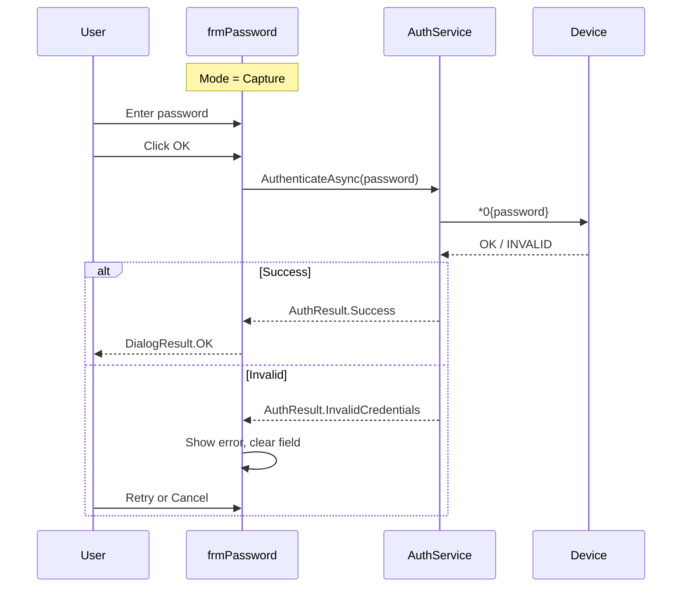
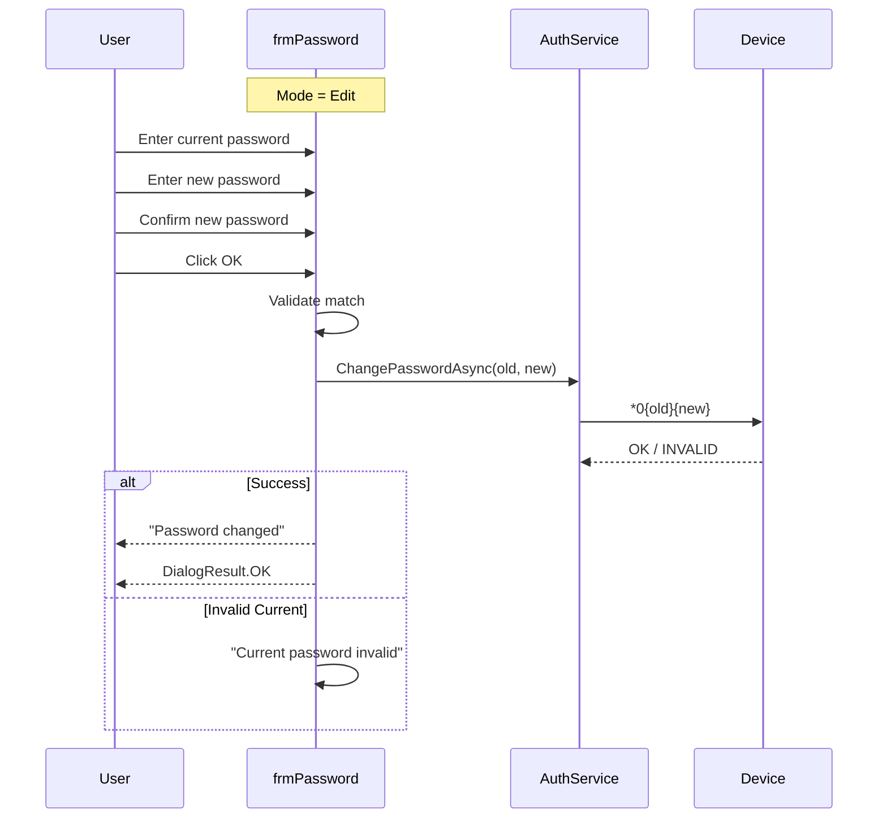

# frmPassword - Device Password

## General Information

| Attribute | Value |
|-----------|-------|
| **File** | `Forms/frmPassword.cs` |
| **Namespace** | `Fiplex.Control.Software.WinForms.Forms` |
| **Type** | Modal Dialog |
| **Lines of Code** | ~250 |

## Purpose

Dialog for device password management with two operating modes:
1. **Capture Mode**: Request password during connection
2. **Edit Mode**: Change password from menu

## Serial Commands

| Command | Direction | Description |
|---------|-----------|-------------|
| `*0{password}` | Write | Authenticate with device |
| `*0{old}{new}` | Write | Change password (edit mode) |

## Injected Dependencies

| Service | Interface | Purpose |
|---------|-----------|---------|
| `_authService` | `IAuthService` | Device authentication |
| `_logger` | `ILogger<frmPassword>` | Logging |

## Operating Modes

### Capture Mode (Connection)



### Edit Mode (Change Password)



## Public Properties

| Property | Type | Description |
|----------|------|-------------|
| `Mode` | `PasswordMode` | Capture or Edit |
| `Password` | `string?` | Entered password (capture mode) |
| `IsAuthenticated` | `bool` | Authentication succeeded |

## Password Mode Enum

```csharp
public enum PasswordMode
{
    Capture,  // During connection
    Edit      // Change password from menu
}
```

## UI Controls

| Control | Type | Capture Mode | Edit Mode |
|---------|------|--------------|-----------|
| `txtPassword` | TextBox | ✅ Visible | ✅ "Current" |
| `txtNewPassword` | TextBox | ❌ Hidden | ✅ "New" |
| `txtConfirm` | TextBox | ❌ Hidden | ✅ "Confirm" |
| `btnOK` | Button | ✅ "OK" | ✅ "Change" |
| `btnCancel` | Button | ✅ | ✅ |

## Visual Layout

### Capture Mode

```
┌──────────────────────────────────────┐
│  Device Password                     │
├──────────────────────────────────────┤
│                                      │
│  Enter device password:              │
│                                      │
│  Password: [****************]        │
│                                      │
│         [OK]        [Cancel]         │
│                                      │
└──────────────────────────────────────┘
```

### Edit Mode

```
┌──────────────────────────────────────┐
│  Change Password                     │
├──────────────────────────────────────┤
│                                      │
│  Current:  [****************]        │
│                                      │
│  New:      [****************]        │
│                                      │
│  Confirm:  [****************]        │
│                                      │
│       [Change]      [Cancel]         │
│                                      │
└──────────────────────────────────────┘
```

## Main Methods

### ConfigureForMode

```csharp
public void ConfigureForMode(PasswordMode mode)
{
    Mode = mode;
    
    if (mode == PasswordMode.Capture)
    {
        Text = "Device Password";
        txtNewPassword.Visible = false;
        txtConfirm.Visible = false;
        lblNew.Visible = false;
        lblConfirm.Visible = false;
        btnOK.Text = "OK";
    }
    else // Edit
    {
        Text = "Change Password";
        txtNewPassword.Visible = true;
        txtConfirm.Visible = true;
        lblNew.Visible = true;
        lblConfirm.Visible = true;
        btnOK.Text = "Change";
    }
}
```

### ValidateAndSubmit

```csharp
private async Task ValidateAndSubmitAsync()
{
    if (Mode == PasswordMode.Edit)
    {
        if (txtNewPassword.Text != txtConfirm.Text)
        {
            ShowError("Passwords do not match");
            return;
        }
        
        if (string.IsNullOrEmpty(txtNewPassword.Text))
        {
            ShowError("New password cannot be empty");
            return;
        }
    }
    
    await SubmitPasswordAsync();
}
```

## Validation

| Field | Validation |
|-------|------------|
| Password | Required, max 8 chars |
| New Password | Required (edit mode), max 8 chars |
| Confirm | Must match New Password |

## Integration with Pipeline

When authentication fails with `INVALID CREDENTIALS`, the pipeline raises `CredentialsRequired`:

```csharp
// In SerialCommandPipeline
if (response.Contains("INVALID CREDENTIALS"))
{
    CredentialsRequired?.Invoke(this, EventArgs.Empty);
}

// In frmMain
_pipeline.CredentialsRequired += async (s, e) =>
{
    using var dialog = _serviceProvider.GetRequiredService<frmPassword>();
    dialog.ConfigureForMode(PasswordMode.Capture);
    
    if (dialog.ShowDialog(this) == DialogResult.OK)
    {
        await _authService.AuthenticateAsync(dialog.Password);
    }
};
```

---

**Previous**: [Login](./Login.md) | **Next**: [Forms Index](./forms-index.md)
