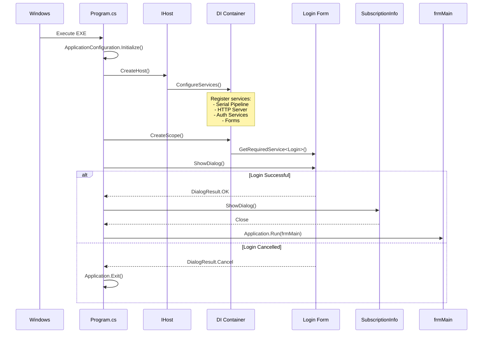
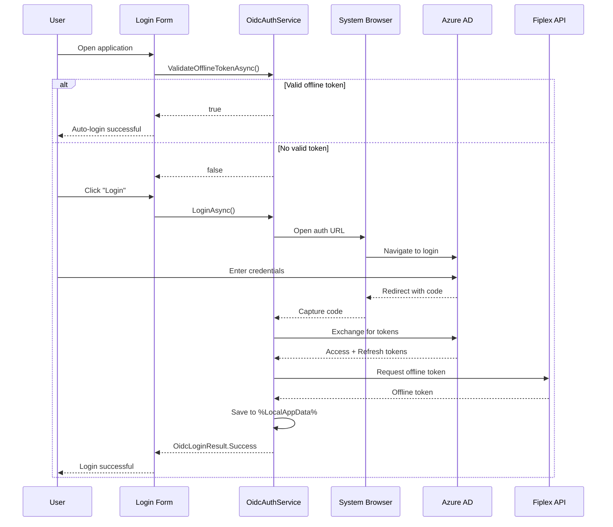
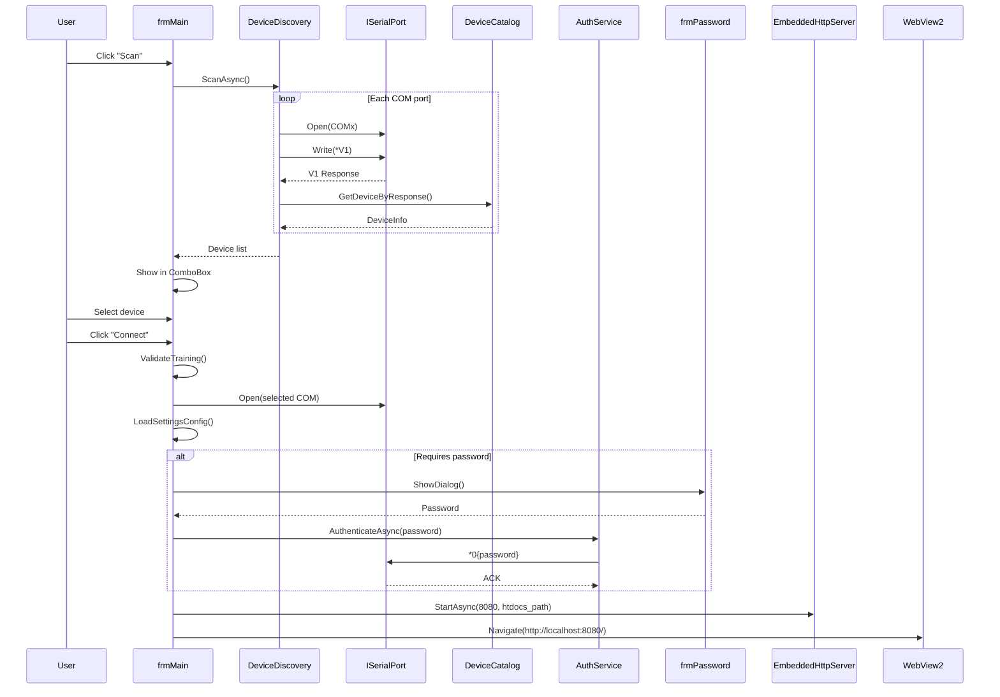
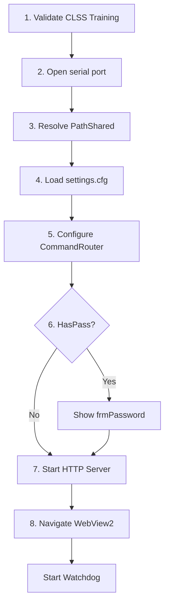
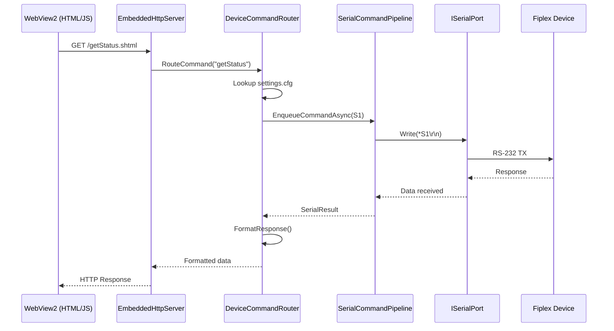
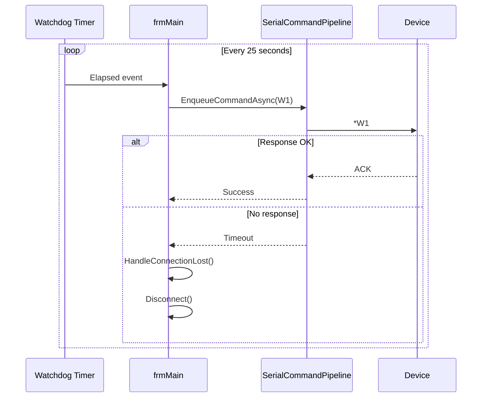

# Operational Flows

## Flow Index

This document describes the main operational flows of the Fiplex Control Software system.

## Documented Flows

| # | Flow | Description |
|---|------|-------------|
| 1 | [Initialization](#initialization-flow) | Application startup |
| 2 | [User Authentication](#user-authentication-flow) | OIDC login |
| 3 | [Device Connection](#device-connection-flow) | Serial connection |
| 4 | [HTTP-Serial Commands](#http-serial-command-flow) | Command processing |
| 5 | [Watchdog](#watchdog-flow) | Device keepalive |

---

## Initialization Flow

### Objective

Initialize all services and prepare the application for user interaction.

### Sequence Diagram

### Detailed Steps

1. **WinForms Initialization**
   - `ApplicationConfiguration.Initialize()` configures DPI awareness

2. **Host Creation**
   - Load `appsettings.json`
   - Configure logging (Console, Debug)
   - Register services in DI container

3. **Login Flow**
   - If valid offline token → auto-login
   - If not → show login form

4. **Subscription Information**
   - Show CLSS training/license status

5. **Main Form**
   - `Application.Run(frmMain)` starts message loop

---

## User Authentication Flow

### Objective

Authenticate the user via OIDC to access the system.

### Sequence Diagram

### Validations

| Validation | Location | Action on Failure |
|------------|----------|-------------------|
| Offline token present | `OnLoad` | Show login |
| Token not expired | `ValidateOfflineTokenAsync` | Show login |
| Valid signature | `OfflineTokenValidator` | Show login |
| Valid training | `TrainingValidationService` | Warning + continue |

---

## Device Connection Flow

### Objective

Establish serial connection with a Fiplex device and load its web interface.

### Sequence Diagram

### Connection Phases (8)

---

## HTTP-Serial Command Flow

### Objective

Translate HTTP requests from WebView2 UI to serial commands.

### Sequence Diagram

---

## Watchdog Flow

### Objective

Maintain connection alive and detect disconnections.

### Sequence Diagram

---

**Previous**: [Forms](../30-forms/forms-index.md) | **Next**: [Error Handling](../50-errors-and-logging/error-handling.md)
