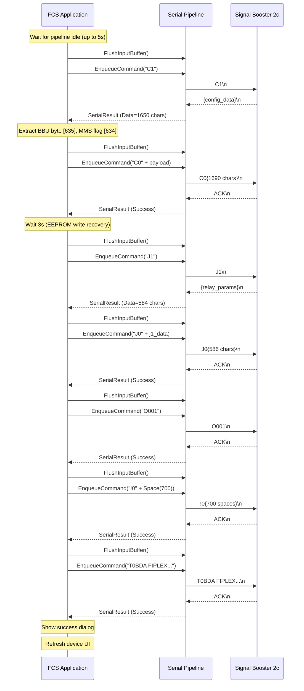

# Production Test — Clear EEPROM Flow (Signal Booster 2c/BDA)

## Purpose

The Clear EEPROM operation resets a Signal Booster device to a known factory state. It applies a fixed production configuration (C0), resets relay/alarm parameters (J0), clears the operation log (O001), wipes EEPROM user data (!0), and resets the device tag (T0). It is only available to factory-level users.

**Applies to:** `tdev = "2c"`, `ndev >= 2.0`, `clearROM = true`

---

## Command Sequence

```
C1  →  C0  →  J0  →  O001  →  !0  →  T0
```

| Step | Command | Direction | Response | Purpose |
|------|---------|-----------|----------|---------|
| 0 | `C1` | Read | Data frame (~1650 chars) | Pre-read to extract BBU byte and MMS flag needed to build C0 |
| 1 | `C0` | Write | ACK | Apply fixed production configuration |
| 2 | `J1` | Read | Data frame (~584 chars) | Pre-read relay/alarm parameters from device |
| 3 | `J0` | Write | ACK | Write relay/alarm parameters back (using J1 data as payload) |
| 4 | `O001` | Write | ACK | Clear device operation log |
| 5 | `!0` + Space(700) | Write | ACK | Clear EEPROM user data |
| 6 | `T0BDA FIPLEX...` | Write | ACK | Reset device tag |

> J1 is not a user-visible step — it is an internal pre-read done immediately before J0.

---

## Pre-Conditions

- Device is connected and responding on USB/serial
- User has factory-level credentials (password authenticated)
- Pipeline is idle (no pending commands from watchdog/status polling)

---

## Pipeline State Management

### Wait-for-Idle Before Starting

The device watchdog timer sends periodic status commands (S1) while connected. Before starting the production sequence, the code waits up to 5 seconds for the pipeline to become idle (`IsWaitingAnswer = false`). If still busy after 5 seconds, pending commands are cancelled via `CancelPendingCommands()`.

```
Wait up to 5s:
  IsWaitingAnswer == false → proceed
  Timeout → CancelPendingCommands() → wait 200ms → proceed
```

### FlushInputBuffer Between Commands

Before each command in the sequence, `FlushInputBuffer()` is called. This resets the protocol parser (`_parser.Reset()`) to discard any residual bytes from the previous response. It does **not** discard the OS-level serial buffer — this mirrors VB 1.9 behavior for password-protected devices (`deviceWithPass = true`).

### Post-C0 Delay

After C0 is acknowledged, the application waits **3 seconds** before sending J0. C0 triggers an EEPROM write on the device (RTT ≈ 1100ms). The additional delay allows the device firmware to complete internal write operations before accepting the next command.

---

## C1 Pre-Read — Extracting Device-Specific Fields

Before building C0, a C1 read is performed to extract two fields from the response:

| Field | Position in C1 response | Type | Usage |
|-------|------------------------|------|-------|
| MMS flag | `response[634]` (hex pair at chars 634–635) bit 0 | bool | Selects J command variant in older firmware (2c v1.x) |
| BBU byte | `response[635]` (single char at index 635) | char `'0'`–`'3'` | Appended at position 1689 in C0 payload to preserve BBU connection state |

The C0 payload is a fixed 1690-char hex string with the BBU byte inserted at position 1689. All other fields are production-default values.

**C1 timeout:** AckTimeout = 2s, DataTimeout = 10s. If the response is shorter than 1650 chars or the read fails, the operation is aborted.

---

## J Command — Relay/Alarm Parameters

### Why J1 Pre-Read Is Required

The J command payload encodes relay thresholds, alarm masks, and I/O labels. The device firmware validates that the payload length matches **exactly** the format it supports.

Firmware versions differ in J payload length:

| Firmware | J data length | Total J0 payload |
|----------|--------------|-----------------|
| 2c v1.x (older) | 557 chars | 559 chars (`"J0"` + 557) |
| 2c v2.0 (current) | 584 chars | 586 chars (`"J0"` + 584) |

The extended format in v2.0 adds 27 additional bytes in the hex parameter block (approximately at data positions 150–197). These bytes contain device-specific calibration values that are not present in the v1.x parameter set.

Sending the v1.x-length payload to a v2.0 device causes a NACK response. There is no way to determine the required length from the device version alone without reading J1 first.

### Write-Back Approach

The correct approach for any firmware version is:

1. **Send J1** (read relay/alarm parameters from device)
2. **Use J1 data directly as J0 payload**: `"J0" + j1Result.Data`
3. **Send J0** with the J1-sourced payload

This guarantees that:
- The payload length matches what the device firmware expects
- Device-specific bytes are preserved (they are written back unchanged)
- The operation is idempotent with respect to user-visible relay/alarm settings

**Fallback:** If J1 fails (no response or error status), the code falls back to a fixed 559-char payload derived from the v1.x parameter set. This covers older devices that do not support the extended J format.

### J Command Internal Structure (for reference)

```
J0{params_hex}{labels_text}
   ^           ^
   |           |
   Hex block   ASCII label strings, each padded to 30 chars
   (variable length per firmware version)
```

The hex block encodes numeric thresholds and masks. The label block contains 8 fixed-width (30 char) strings for relay/alarm input names. Total length = hex block + 240 chars (8 × 30).

---

## !0 (Clear EEPROM) Payload

```
"!0" + Space(700)
```

The `!0` command requires a 700-byte padding payload. The device uses this space as a write buffer during the EEPROM erase sequence. Sending fewer than 700 bytes causes a premature end-of-frame and the device will NACK.

---

## T0 (Reset Tag) Payload

```
"T0BDA FIPLEX          "
```

Fixed string. Resets the device's user-visible tag/label to the factory default.

---

## Error Handling

Each command is sent with `MaxRetries = 1` (one initial attempt plus one retry on NACK), matching VB 1.9 behavior.

If any command in the sequence fails after retries:
- The operation is aborted immediately
- A failure dialog is shown: `"Failed to apply {operationName}. Please check the device connection and try again."`
- The device is left in a partially configured state — the operator must retry the full sequence

On success:
- An information dialog confirms completion
- The device UI panel is refreshed

---

## Sequence Diagram



---

## Timeouts

| Command | AckTimeout | DataTimeout |
|---------|-----------|------------|
| C1 | 2s | 10s |
| C0 | 10s | — |
| J1 | 3s | 5s |
| J0 | 10s | — |
| O001 | 5s | — |
| !0 | 15s | — |
| T0 | 5s | — |

---

## Diagnostic Log

During execution, a plain-text log is written to `%TEMP%\fcs_prod_log.txt`. Each line is timestamped. The log captures:
- Pipeline idle/busy state before start
- C1 result including BBU byte and MMS flag
- Per-command send/result with RTT and retry count
- J1 pre-read result and payload length comparison
- J1→J0 write-back confirmation with payload length

This file is the primary diagnostic tool for failures in the field. Retain it when reporting production test issues.
