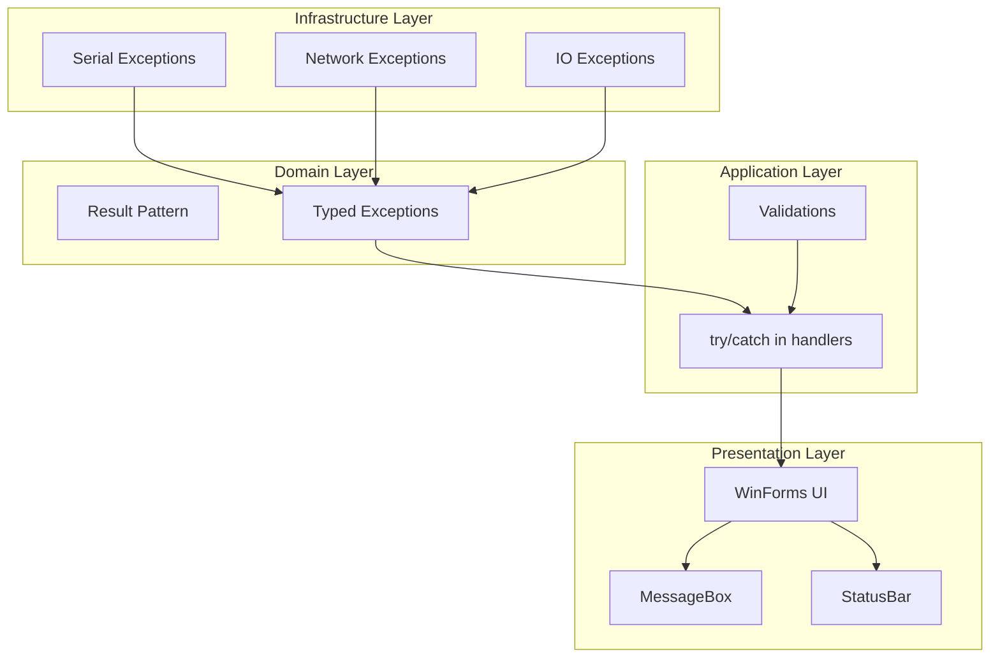
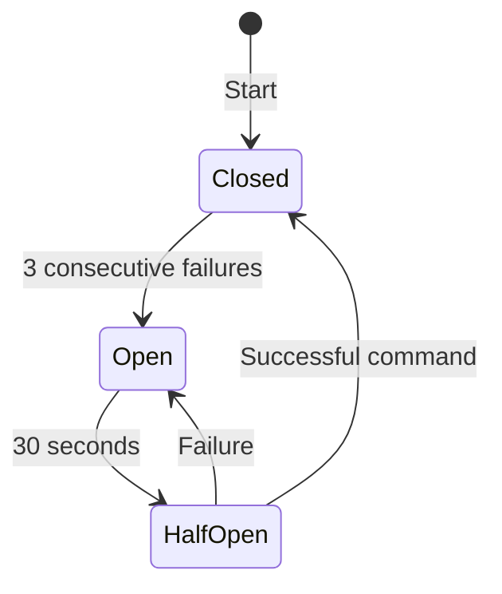

# Error Handling and Logging

## Error Handling Strategy

### General Principles

1. **Fail Fast**: Detect errors early and report them clearly
2. **Graceful Degradation**: System continues functioning when possible
3. **User Feedback**: Clear and actionable messages for the user
4. **Complete Logging**: Every exception is logged with context

## Error Handling Layers



## Exceptions by Layer

### Serial Layer

| Exception | Cause | Handling |
|-----------|-------|----------|
| `UnauthorizedAccessException` | COM port in use | Message: "Port in use by another application" |
| `TimeoutException` | No device response | Retry or disconnection |
| `IOException` | Cable disconnected | Automatic disconnection |
| `InvalidOperationException` | Port not open | Reconnection |

### HTTP Layer

| Exception | Cause | Handling |
|-----------|-------|----------|
| `SocketException` | HTTP port busy | Try next port (8080-8090) |
| `HttpListenerException` | Listener error | Log + server restart |

### Authentication Layer

| Exception | Cause | Handling |
|-----------|-------|----------|
| `OidcException` | OIDC flow error | Message according to error code |
| `SecurityTokenException` | Invalid token | Force re-login |

## Result Pattern

The system uses `SerialResult` to communicate success/failure without exceptions:

```csharp
public record SerialResult
{
    public bool Success { get; init; }
    public string Data { get; init; }
    public CommandResultStatus Status { get; init; }
    public TimeSpan ElapsedTime { get; init; }
    public int RetryCount { get; init; }
}

public enum CommandResultStatus
{
    Success,
    Timeout,
    NakReceived,
    InvalidCredentials,
    Cancelled,
    PortClosed,
    Error
}
```

### Result Pattern Usage

```csharp
var result = await _pipeline.EnqueueCommandAsync(command);

if (result.Success)
{
    ProcessResponse(result.Data);
}
else
{
    switch (result.Status)
    {
        case CommandResultStatus.Timeout:
            _logger.LogWarning("Command timed out");
            break;
        case CommandResultStatus.InvalidCredentials:
            await RequestCredentialsAsync();
            break;
        case CommandResultStatus.NakReceived:
            _logger.LogError("Device rejected command");
            break;
    }
}
```

## Circuit Breaker

The `DeviceCommandRouter` implements circuit breaker to protect against cascading failures:



### Configuration

```csharp
private const int MaxConsecutiveFailures = 3;
private const int CircuitBreakerResetMs = 30000;
```

---

## Logging System

### Configuration

```json
{
  "Logging": {
    "LogLevel": {
      "Default": "Debug",
      "Microsoft": "Warning",
      "System": "Warning",
      "Fiplex": "Debug"
    }
  }
}
```

### Logging Providers

| Provider | Destination | Usage |
|----------|-------------|-------|
| `Console` | Console window | Development |
| `Debug` | Visual Studio Output | Debug |
| `File` (future) | Files on disk | Production |

### Log Levels

| Level | Usage in Fiplex |
|-------|-----------------|
| `Trace` | Serial frame data |
| `Debug` | Operation flow |
| `Information` | Important events (connection, login) |
| `Warning` | Recoverable abnormal situations |
| `Error` | Operation failures |
| `Critical` | Failures preventing operation |

### Logging Examples

```csharp
// Information - important events
_logger.LogInformation("Device connected: {DeviceName} on {Port}", 
    device.NameTypeDevice, comPort);

// Warning - abnormal situations
_logger.LogWarning("Command retry {RetryCount}/{MaxRetries}: {Command}",
    retryCount, maxRetries, command);

// Error - failures with context
_logger.LogError(ex, "Failed to process HTTP command: {Command}", 
    commandName);

// Debug - detailed flow
_logger.LogDebug("Serial TX: {Data}", BitConverter.ToString(buffer));
```

## User-Facing Messages

### Message Types

| Type | Icon | Usage |
|------|------|-------|
| Error | ❌ | Critical failures |
| Warning | ⚠️ | Attention required |
| Information | ℹ️ | Confirmations |
| Question | ❓ | User decisions |

### Message Guidelines

1. **Be specific**: "Cannot connect to COM3" not "Connection failed"
2. **Be actionable**: "Check cable and try again"
3. **Avoid technical jargon**: For end users
4. **Log technical details**: For support

---

**Previous**: [Operational Flows](../40-operational-flows/operational-flows.md) | **Next**: [Integrations](../60-integrations/external-integrations.md)
