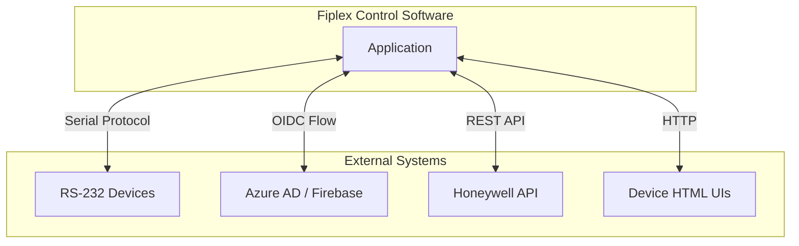
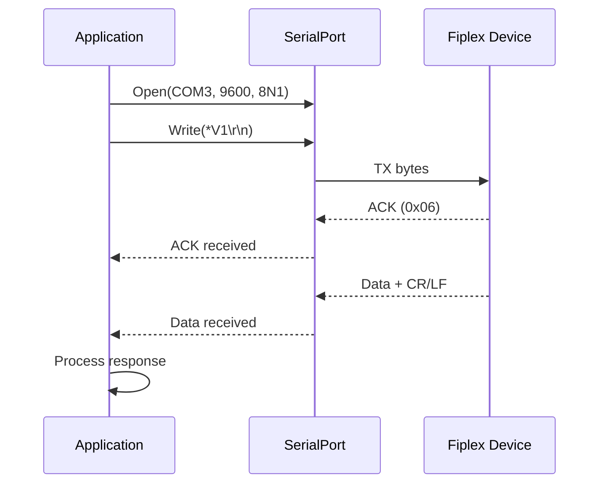
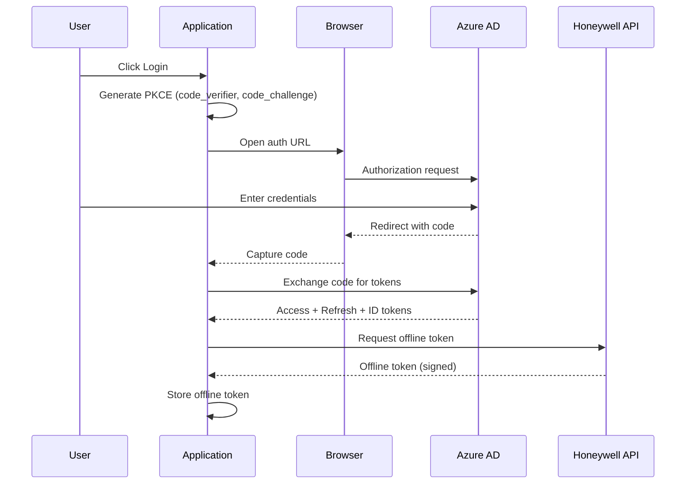
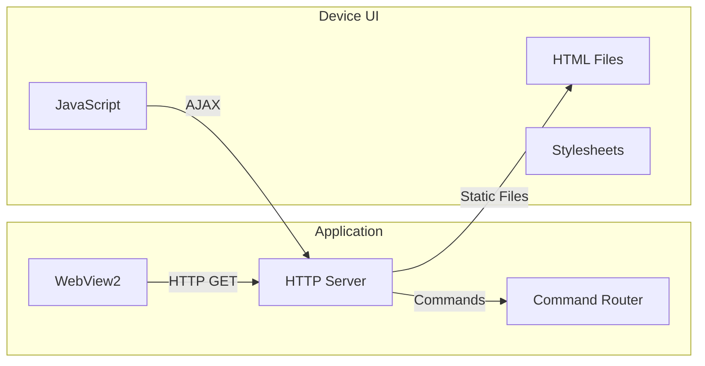

# External Integrations

## Integration Overview

The system integrates with several external systems and protocols:



## Serial Communication (RS-232)

### Connection Parameters

| Parameter | Value |
|-----------|-------|
| Baud Rate | 9600 |
| Data Bits | 8 |
| Parity | None |
| Stop Bits | 1 |
| Flow Control | None |

### Protocol Format

| Element | Description |
|---------|-------------|
| Command Prefix | `*` |
| Terminator | CR/LF (`\r\n`) |
| ACK | `0x06` |
| NAK | `0x15` |

### Command Examples

```
TX: *V1\r\n          → Request version
RX: 0x06             → ACK
RX: Fiplex000000085\r\n → Device ID

TX: *S1\r\n          → Request status
RX: 0x06             → ACK
RX: 0123456789AB\r\n → Hex-encoded status
```

### Serial Communication Diagram



---

## OIDC Authentication

### Flow Type

**Authorization Code with PKCE** for desktop applications.

### Identity Providers

| Provider | Usage |
|----------|-------|
| Azure AD | Corporate users |
| Firebase | Consumer users |

### Configuration

```json
{
  "OidcSettings": {
    "Authority": "https://login.microsoftonline.com/{tenant}",
    "ClientId": "{client-id}",
    "RedirectUri": "http://localhost:5000/callback",
    "Scope": "openid profile email offline_access"
  }
}
```

### Authentication Flow



### Token Storage

```
%LocalAppData%\Fiplex\tokens\
├── offline.token      # Encrypted offline token
└── refresh.token      # Refresh token (if applicable)
```

---

## Honeywell API

### Endpoints

| Endpoint | Purpose |
|----------|---------|
| `/accessmanagement/offline-token` | Request offline token |
| `/training/validate` | Validate CLSS certification |

### Request Example

```http
POST /accessmanagement/offline-token HTTP/1.1
Host: fire.us.honeywell.com
Authorization: Bearer {access_token}
Content-Type: application/json

{
  "deviceId": "unique-device-id",
  "scope": "clss-training"
}
```

### Response

```json
{
  "offlineToken": "eyJhbGciOiJSUzI1NiIs...",
  "expiresAt": "2025-12-31T23:59:59Z",
  "trainingExpiry": "2025-06-15T00:00:00Z"
}
```

---

## Device HTML UIs

### Architecture



### Special Extensions

| Extension | Purpose |
|-----------|---------|
| `.zhtml` | Commands returning formatted HTML |
| `.shtml` | Commands returning raw data |
| `.jsm` | Commands returning JavaScript-compatible data |

### UI File Structure

```
pages/htdocs_2c1/
├── index.html         # Main page
├── settings.cfg       # Command mappings
├── settingsW.cfg      # Alternative mappings
├── css/
│   └── style.css
├── js/
│   ├── main.js
│   └── commands.js
└── img/
    └── logo.png
```

### settings.cfg Format

```
GET|getVersion|V1|false      # GET /getVersion → *V1
GET|getStatus|S1|true        # GET /getStatus → *S1 (hex decode)
POST|setConfig|C2|true|data  # POST /setConfig → *C2{data}
```

---

## Integration Summary

| System | Protocol | Purpose |
|--------|----------|---------|
| Fiplex Devices | RS-232 Serial | Hardware control |
| Azure AD | OIDC | User authentication |
| Honeywell API | HTTPS/REST | Offline tokens, training |
| Device UIs | HTTP (local) | User interface rendering |

---

**Previous**: [Error Handling](../50-errors-and-logging/error-handling.md) | **Next**: [Quality](../70-quality-and-maintainability/code-quality.md)
