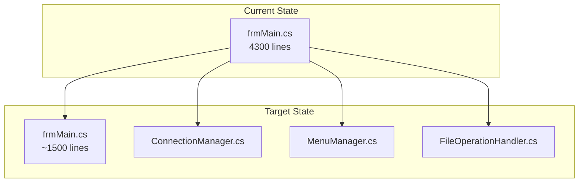

# Code Quality and Maintainability

## Quality Overview

This document describes the code quality practices and technical debt management for the Fiplex Control Software project.

## Code Standards

### C# Conventions

| Aspect | Convention |
|--------|------------|
| Naming | PascalCase for public, _camelCase for private fields |
| Nullable | Enabled project-wide |
| Async | Suffix `Async` for async methods |
| Interfaces | Prefix `I` for interfaces |

### File Organization

```csharp
// File: MyService.cs
namespace Fiplex.Control.Software.WinForms.Core.Services;

using System;
using Microsoft.Extensions.Logging;

/// <summary>
/// Service description.
/// </summary>
public class MyService : IMyService
{
    // 1. Constants
    private const int DefaultTimeout = 5000;
    
    // 2. Private fields
    private readonly ILogger<MyService> _logger;
    
    // 3. Constructor
    public MyService(ILogger<MyService> logger)
    {
        _logger = logger;
    }
    
    // 4. Public methods
    public async Task<Result> DoWorkAsync()
    {
        // Implementation
    }
    
    // 5. Private methods
    private void HelperMethod()
    {
        // Implementation
    }
}
```

## Technical Debt

### Known Issues

| Area | Issue | Priority | Notes |
|------|-------|----------|-------|
| frmMain | Large file (~4300 lines) | Medium | Consider splitting |
| Serial | Sync/async mixing | Low | Works correctly |
| Tests | Low coverage | High | Add unit tests |
| Docs | Incomplete EN mirror | Medium | In progress |

### Refactoring Opportunities



## Testability

### Current Testing

| Type | Coverage | Notes |
|------|----------|-------|
| Unit Tests | Low | Focus on Core services |
| Integration Tests | None | Manual testing |
| UI Tests | None | Not planned |

### Testable Patterns

The codebase uses patterns that support testing:

1. **Dependency Injection**: All services injected via constructor
2. **Interfaces**: All dependencies are interfaces
3. **Simulated Port**: `SimulatedSerialPort` for testing without hardware

### Example Test

```csharp
[Fact]
public async Task Pipeline_ShouldReturnTimeout_WhenNoResponse()
{
    // Arrange
    var mockPort = new Mock<ISerialPort>();
    mockPort.Setup(p => p.ReadAsync(It.IsAny<CancellationToken>()))
        .ThrowsAsync(new TimeoutException());
    
    var pipeline = new SerialCommandPipeline(mockPort.Object, _logger);
    
    // Act
    var result = await pipeline.EnqueueCommandAsync(new SerialCommand
    {
        Payload = "V1",
        ExpectsAck = true
    });
    
    // Assert
    Assert.False(result.Success);
    Assert.Equal(CommandResultStatus.Timeout, result.Status);
}
```

## Code Analysis

### Enabled Analyzers

```xml
<PropertyGroup>
  <EnableNETAnalyzers>true</EnableNETAnalyzers>
  <AnalysisLevel>latest</AnalysisLevel>
  <EnforceCodeStyleInBuild>true</EnforceCodeStyleInBuild>
</PropertyGroup>
```

### Suppressed Warnings

| Code | Reason |
|------|--------|
| CA1416 | Platform-specific (Windows only) |
| CS8618 | Nullable in Designer files |

## Documentation

### XML Documentation

```csharp
/// <summary>
/// Authenticates with the device using the provided password.
/// </summary>
/// <param name="password">Device password (max 8 chars).</param>
/// <returns>Authentication result with ucVersion if successful.</returns>
/// <exception cref="ArgumentNullException">If password is null.</exception>
public async Task<AuthResult> AuthenticateAsync(string password)
```

### VB.NET Migration Comments

```csharp
// Equivalente VB.NET: For i = 0 To 5
for (int i = 0; i <= 5; i++)
{
    // Migration from VB6 control arrays
    _checkboxes[i].Checked = (mask & (1 << i)) != 0;
}
```

## Performance Considerations

### Async Best Practices

```csharp
// ✅ Good: Async all the way
public async Task LoadDataAsync()
{
    var data = await _service.GetDataAsync();
    UpdateUI(data);
}

// ❌ Avoid: Blocking on async
public void LoadData()
{
    var data = _service.GetDataAsync().Result; // Deadlock risk!
}
```

### Memory Management

```csharp
// ✅ Good: Using statement for disposables
using var cts = new CancellationTokenSource();
await _pipeline.EnqueueCommandAsync(command, cts.Token);

// ✅ Good: Cleanup in OnFormClosing
protected override void OnFormClosing(FormClosingEventArgs e)
{
    _cts?.Cancel();
    _cts?.Dispose();
    base.OnFormClosing(e);
}
```

## Maintenance Checklist

### Before Release

- [ ] Run all analyzers with no warnings
- [ ] Verify no hardcoded credentials
- [ ] Update version numbers
- [ ] Update documentation
- [ ] Test on clean Windows install

### Regular Maintenance

- [ ] Update NuGet packages (quarterly)
- [ ] Review and address TODO comments
- [ ] Check for deprecated APIs
- [ ] Verify WebView2 runtime compatibility

---

**Previous**: [Integrations](../60-integrations/external-integrations.md) | **Next**: [Overview](../00-introduction/overview.md)
